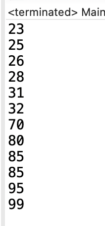

# 스트림

스트림은 자바 8부터 추가된 컬렉션의 저장 요소를 하나씩 참조해서 람다식으로 처리할 수 있도록 해주는 반복자이다.


## 예제에 사용할 소스

예제를 위해 간단한 클래스와 enum을 만들어 둔다.

```java
package stream;

public enum City{
	Anyang(3), Mapo(2), Gong(1);

	private int number;
	
	City(int number) {
		this.number = number;
	}
	
	public int getNumber() {
		return number;
	}
	
	public String toString() {
		return name() + "," + number;
	}
}
```

City enum

```java
package stream;

public class Student {
	public enum Sex { Male, Female };
	
	City city;
	Sex sex;
	String name;
	int age;
	int score;
	
	
	public Student(City city, Sex sex, String name, int age, int score) {
		this.city = city;
		this.sex = sex;
		this.name = name;
		this.age = age;
		this.score = score;
	}

	public City getCity() {
		return city;
	}

	public Sex getSex() {
		return sex;
	}
	public String getName() {
		return name;
	}
	public int getAge() {
		return age;
	}
	public int getScore() {
		return score;
	}

	@Override
	public String toString() {
		return "Student [city=" + city + ", sex=" + sex + ", name=" + name + ", age=" + age + ", score=" + score + "]";
	}
	
}
```

Student.java


## 기본 사용법

### 컬렉션, 배열로 부터 스트림 얻기

```java
package stream;

import java.util.Arrays;
import java.util.List;

import stream.Student.Sex;

public class Main {
	static List<Student> list = Arrays.asList(
			new Student(City.Anyang, Sex.Male, "성호준", 28, 80),
			new Student(City.Anyang, Sex.Female, "최진영", 25, 85),
			new Student(City.Mapo, Sex.Male, "김쇠돌", 32, 95),
			new Student(City.Gong, Sex.Female, "이춘향", 23, 70),
			new Student(City.Mapo, Sex.Female, "성현정", 31, 99),
			new Student(City.Gong, Sex.Male, "김국대", 26, 85)
			);
	
	public static void main(String[] args) {
		// TODO Auto-generated method stub
		list.stream().forEach(System.out::println);
	}

}
```

메인 함수에서 list를 생성하고 main 함수에서 리스트를 스트림으로 사용한다.

컬렉션에 대해서는 strea() 메소드를 사용하면 되고, 배열의 경우 Arrays.strea(arr) 을 사용하면 스트림을 얻을 수 있다.

가장 기본적으로 각 요소를 순회하는 forEach() 로 출력을 해보았다. println을 람다식으로 넘겨주면 된다.

### 중간 처리 스트림

```java
	public static void main(String[] args) {
		// TODO Auto-generated method stub
		list.stream().mapToInt(Student::getAge).forEach(System.out::println);
	}
```

객체를 정수형으로 바꿔주는 mapToInt 중간 처리 스트림을 넣어 나이를 추출하여 실행해보았다. 그결과 아래 처럼 나이만 추출되어 출력되는 것을 볼 수 있다.


### 스트림을 얻는 다양한 방법

```java

	public static void main(String[] args) {
		// TODO Auto-generated method stub
//		list.stream().mapToInt(Student::getAge).forEach(System.out::println);
		IntStream.range(0, 10).forEach(System.out::println);
	}
```

위 코드 처럼 컬렉션이나 배열에 의존하지 않고 스트림을 만들 수도있다. 실행 결과는 아래와 같다.


```java
	public static void main(String[] args) {
		// TODO Auto-generated method stub
		Random random = new Random();
		random.ints(5, 0, 15).forEach(System.out::println);
	}
```

위 코드처럼 랜덤수를 만들어 스트림으로 바로 사용할 수도있다.


이 밖에도 다양한 스트림을 얻을 수 있다.


## 스트림 파이프 라인

스트림에는 중간처리와 최종처리 스트림이 있다. 중간 처리 과정에서 데이터를 필터링, 매핑, 정렬, 그룹핑을 진행하고 최종 처리에서 합계, 평균, 카운팅, 최대값, 최소값 등을 추출하는 리덕션을 진행한다. 이때 중간 스트림이 생성될때 요소들이 바로 처리되는게 아니라 최종 처리가 시작되기 전까지 지연(Lazy) 된다. 따라서 중간 처리 스트림만 파이프라이닝 해두면 실행되지 않고 최종 처리 스트림을 붙여줘야만 실행된다.

다양한 중간 처리 메소드와 최종 처리 메소드가 제공되는데 이에 대한 구분은 리턴 타입을 보고 알 수 있다. 중간 처리 메서드는 스트림 타입을 반환하고 최종 처리 메서드는 스트림이 아닌 최종결과 (boolean, int 등 다양한 타입)을 반환한다.


### 필터링 (distinct(), filter())

필터링은 중간 처리기능으로 요소를 걸러낸다. distinct는 요소들 중 중복을 제거하는데, 이때 전달된 객체의 equals() 메서드를 사용한다.

filter는 Predicate 타입의 람다식(boolean 타입 을 리턴)을 주게 되면 true를 반환하는 요소만 다음 스트림으로 전달한다.


### 매핑(flatMapXXX(), mapXXX() )

flatMapXXX 메소드는 요소를 대체하는 복수 개의 요소들로 구성된 새로운 스트림을 리턴한다.

```java
public static void main(String[] args) {
		list.stream()
			.flatMap(s -> Arrays.stream(new String[] {s.getCity().name(), s.getSex().name()}))
			.forEach(System.out::println);
	}
```


이렇게 요소를 요소의 City의 이름과 Sex의 이름으로 대체하여 새로운 스트림을 만들어 출력해 보았다.

여기서 주의해야할 점은 flatMap에 사용되는 람다식의 리턴타입이 스트림이라는 점이다. 여기서는 Arrays.stream 메소드로 배열을 스트림으로 만들어 리턴해 주었다. 그런데 만약 참조 타입이 아닌 원시 타입인 경우에는 flatMap 메서드가 아니라 flatMapXXX 메서드를 써야한다. int형 배열로 Arrays.stream() 을 호출하면 Stream 타입이 아닌 IntStream이 반환되는데, flatMap은 Stream 형이 리턴되어야 하기 때문에 에러가 발생한다.

따라서 flatMapToInt 메서드를 사용하여 IntStream을 반환 받을 수 있게 해야한다.

```java
public static void main(String[] args) {
		list.stream()
			.flatMap(s -> Arrays.stream(new int [] {s.getAge(), s.getScore()})) // 타입 미스 매치 에러
			.forEach(System.out::println);
	}
```

아니면 int 형 배열이 아니라 Integer 형 배열로 참조 타입으로 만들어줘도 된다.

```java
public static void main(String[] args) {
		list.stream()
			.flatMap(s -> Arrays.stream(new Integer [] {s.getAge(), s.getScore()}))
			.forEach(System.out::println);
	}
```

물론 정석은 아래와 같이 flatMapToInt를 쓰는 것일 것이다. 가독성도 증가할 수 있다.

```java
public static void main(String[] args) {
		list.stream()
			.flatMapToInt(s -> Arrays.stream(new int [] {s.getAge(), s.getScore()}))
			.forEach(System.out::println);
	}
```


### mapXXX() 메소드

flatMap 은 1:n으로의 변환이라면, map 은 요소를 다른 요소로 1:1로 변환시킨다고 보면된다.  flatMap은 스트림으로 바꿔서 리턴해줘야 했다면 map은 더 간단하게 단순히 바꿔주기만 하면된다.

```java
	public static void main(String[] args) {
		list.stream()
			.map(s -> s.getName())
			.forEach(System.out::println);
	}
```


여기서는 mapXXX 메소드가 아닌, map 메소드를 사용하고 참조 타입이 아니여도 에러가 나지 않는다. flatMap과 달리  Arrays.stream 를 통한 변환작업을 하지 않기 때문이다.


### asXXXStream(), boxed()

스트림의 타입을 변환하거나 포장하고 싶을 때 위의 메서드를 사용하면 된다.

```java
public static void main(String[] args) {
		list.stream()
			.flatMapToInt(s -> Arrays.stream(new int [] {s.getAge(), s.getScore()}))
			.asDoubleStream()
			.forEach(System.out::println);
	}
```


asDoubleStream() 메서드를 사용하여 int 형이었던 스트림을 double 타입으로 바꿔주었다.

```java
public static void main(String[] args) {
		list.stream()
			.flatMapToInt(s -> Arrays.stream(new int [] {s.getAge(), s.getScore()}))
			.sorted()
			.forEach(System.out::println);
	}
```

sorted()를 통해 간단히 정렬을 해줄 수도 있다.




```java
public static void main(String[] args) {
		list.stream()
			.flatMap(s -> Arrays.stream(new Integer [] {s.getAge(), s.getScore()}))
			.sorted((a,b) -> b.compareTo(a))
			.forEach(System.out::println);
	}
```

내림 차순으로 정렬하고 싶으면 위와 같이 해주면된다. 기본 형에 대해 sorted의 Comparator를 줄 수없으므로 포장후 사용하였다.


### 루핑 (peek(), forEach())

전체 요소를 반복하기 위해서는 위의 두 메서드를 사용하면된다. 기능에서는 동일하지만, peek() 메서드는 중간 처리 메서드이고, forEach() 메서드는 최종 처리 메소드이다. peek() 을 마지막으로 사용하면 스트림이 동작하지 않게 되겠다.

```java
	public static void main(String[] args) {
		list.stream()
			.flatMapToInt(s -> Arrays.stream(new int [] {s.getAge(), s.getScore()}))
			.sorted()
			.peek(System.out::println);
	}
```

위 코드를 실행하면 아무 일도 일어나지 않는다.

```java
	public static void main(String[] args) {
		list.stream()
			.flatMapToInt(s -> Arrays.stream(new int [] {s.getAge(), s.getScore()}))
			.sorted()
			.peek(System.out::println)
			.sum();
	}
```

비록 sum() 의 결과값을 사용하진 않지만 최종 처리 메소드를 끝에 처리해주면 스트림이 동작하게 된다.


### 매칭 (allMatch(), anyMatch(), noneMatch())

최종 처리 단계에서 요소들이 특정 조건에 만족하는지 조사할 수 있는 세가지 매칭 메소드이다. Predicate의 조건을 만족하는지 조사하고 각각 모두 맞는지, 하나라도 맞는지, 아무것도 맞지 않는지 검사하고 결과를 boolean타입으로 리턴한다.

```java
public static void main(String[] args) {
		boolean result1 = list.stream()
			.allMatch(s -> s.getSex() == Sex.Male);
		
		boolean result2 = list.stream()
				.anyMatch(s -> s.getSex() == Sex.Male);
		
		boolean result3 = list.stream()
				.noneMatch(s -> s.getSex() == Sex.Male);
		
		System.out.println(result1);
		System.out.println(result2);
		System.out.println(result3);
	}
```


### 기본 집계 (sum(), count(), average(), max(), min())

집계(Aggregate)는 최정 처리 기능으로 요소들을 처리해서 카운팅, 합계, 평균값, 최대값,최소값 등과 같이 하나의 값으로 산출하는 것을 말한다. 이를 리덕션(Reduction) 이라고 한다.

```java
public static void main(String[] args) {
		long result = list.stream()
				.mapToInt(Student::getAge)
				.count();
		
		System.out.println(result);
	}
```


갯수를 세는 count와  요소의 총합을 구하는 sum() 은 원시형 타입 결과를 리턴하여 그대로 사용하면 된다. 하지만 average()를 비롯한 min(), max() findFirst() 등의 메소드는 OptionalXXX 리턴 타입을 가지는데, 이 타입으로 부터 값을 추출 하려면 get() 또는 getXXX 메서드를 사용하면 된다.

```java
public static void main(String[] args) {
		int result = list.stream()
				.mapToInt(Student::getAge)
				.min()
				.getAsInt();
		
		System.out.println(result);
	}
```


Optional 클래스는 저장하는 값의 타입만 다를 뿐 거의 동일한 기능을 가진다. 집계 값이 존재하지 않을 경우 디폴트 값을 설정할 수 있고 집계 값을 처리하는 Consumer도 등록할 수 있다.  Optional 클래스가 가지는 메소드는 다음과 같다.

- boolean isPresent() : 값이 저장되어 있는지 여부
- T orElse(T) : 값이 저장되지 않은 경우 매개변수 값을 디폴트 값으로 사용.
- void ifPresent(Consumer) : 값이 저장되어 있는경우 Consumer에서 처리.

```java
public static void main(String[] args) {
		List<Student> newList = new ArrayList<>();
		double average = newList.stream()
				.mapToInt(Student::getAge)
				.average()
				.orElse(20);
}
```

위와 같이 빈 리스트에 대해 스트림을 생성하고 평균을 구하면 값이 저장되어 있지 않게되는데, 그때 orElse로 설정한 값이 디폴트 값으로 리턴된다.

```java
public static void main(String[] args) {
		double average = list.stream()
				.mapToInt(Student::getAge)
				.average()
				.orElse(20);
		System.out.println(average);
}
```

만약 빈 리스트가 아니라서 값이 들어있으면 orElse로 준 값은 무시되고, 평균값이 나오게 된다.


```java
public static void main(String[] args) {
		list.stream()
				.mapToInt(Student::getAge)
				.average()
				.ifPresent(a -> System.out.println(a));
	}
```

위와 같이 ifPresent에 Consumer를 전달하여 값이 있을 때만 실행할 수도 있다.


### 커스텀 집계 (reduce())

기본 집계이외의 프로그래밍을 통한 집계의 방법을 제공하기 위해 reduce() 메서드가 제공된다.

```java
	public static void main(String[] args) {
		double aver = list.stream()
				.mapToDouble(Student::getAge)
				.reduce(0, (a, b) -> a + b*b);
		
		System.out.println(aver);
	}
```

분산에서 사용되는 제곱의 합을 구해보았다.

뜬근 없지만 제곱의 평균은 아래와 같을 것이다.

```java
public static void main(String[] args) {
		double aver = list.stream()
				.mapToDouble(Student::getAge)
				.map(a -> a* a)
				.average()
				.getAsDouble();
		
		System.out.println(aver);
	}
```


reduce에 첫번째 인자로 시작값을 줄 수 있다. 이 값을 주지 않으면 reduce의 반환값은 OptionalXXX 타입이 된다.


### 수집 (collect())

내가 생각하기에 가장 강력한 스트림의 기능인 수집 기능이다. 요소들을 필터링 또는 매핑한 후 요소들을 수집하는 최종 처리 메소드인 collect()를 제공한다. 필요한 요소만을 컬렉션으로 담을 수 있고 요소들을 그룹핑한 후 집계 할 수도 있다.

```java
public static void main(String[] args) {
		List<Integer> pow = list.stream()
				.mapToInt(Student::getAge)
				.map(a -> a*a)
				.boxed()
				.collect(Collectors.toList());
		
		pow.stream().forEach(System.out::println);
}
```


Collectors에는 미리 정의된 다양한 collector가 정의 되어잇는데 이를 collect 메소드에 전달하면 원하는 컬렉션을 얻을 수 있다.

Collectors에 정의된 메소드는 다음고ㅘ 같다.

- Collector<T, ?, List<T>> toList()
- Collector<T, ?, Set<T>> toSet()
- Collector<T, ?, Collection<T>> toCollection(Supplier<Collection<T>> s)
- Collector<T, ?, Map<K, U>> toMap(Function<T,K> keyMapper, Function<T, U> valueMapper)
- Collector<T, ?, ConcurrentMap<K, U>> toConcurrentMap( ~~ )


collect의 매개변수 타입은 Collector<T, A, R> 형태로 요소 타입, 누산기, 리턴 타입을 지정하는데, Collectors에 미리 정의된 Collector의 경우 누산기에 대해 이미 정의되어 있으므로 ?로 되어있는 것을 알 수 있다.

toList()로 얻은 콜렉터가 어떻게 정의되어 있는지 궁금하면 자바 코드를 뜯어보자.

```java
 public static <T>
    Collector<T, ?, List<T>> toList() {
        return new CollectorImpl<>((Supplier<List<T>>) ArrayList::new, List::add,
                                   (left, right) -> { left.addAll(right); return left; },
                                   CH_ID);
    }
```

음.. 봐도 잘 모르겠지만 CollectorImpl 클래스를 이용하는데 ArrayList의 생성자를 쓰는거보니 기본적으로 우리가 받은 List는 ArrayList임을 알 수 있고 List::add는 수집기, 마지막 람다식은 컨테이너를 합치는데 사용하는 듯 하다.

세번째 메서드인 toCollection은 List나 Set 말고도 우리가 원하는 콜렉션을 사용할 수 있도록 해준다.

```java
public static void main(String[] args) {
		HashSet<Integer> pow = list.stream()
				.mapToInt(Student::getAge)
				.map(a -> a*a)
				.boxed()
				.collect(Collectors.toCollection(HashSet::new));
		
		pow.stream().forEach(System.out::println);
	}
```


### 그룹핑된 수집

collect() 메소드는 단순히 요소를 수집하는 기능 이외에 컬렉션 요소들을 그룹핑해서 Map 객체를 생성하는 기능도 제공한다. collect()의 매개변수로 Collectors의 groupingBy()가 리턴하는 Collector를 주면 된다.

- Collector<T, ?, Map<K, List<T>>> groupingBy(Function<T, K> classifier) : 요소를 그루핑하여 리스트에 저장.
- Collector<T, ?, Map<K, D>> groupingBy(Function<T, K> classifier, Collector<T, A, D> collector): 요소를 그루핑하며 집계하여 저장.
- Collector<T, ?, Map<K,D>> groupingBy(Function<T, K> classifier, Supplier<Map<K,D>> mapFactory, Collector<T, A, D> collecotor) : 요소를 그루핑하고 집계하여 공급한 Map에 저장.

가장 위의 것은 집계를 위한 Function만 넣어주면 Function이 같은 값을 반환하는 것끼리 묶어 리스트에 넣고, 그 값을 키로 맵에 넣는다.

그 아래의 것은 List에 들어가는 요소들을 하나의 값 또는 객체로 리덕션하여 맵을 만드는 데, 그를 위한 collector가 필요한 것이다.

마지막 것은 두번째 것과 거의 같으나 저장할 맵을 생산하는 Supplier를 제공하여 사용할 맵 타입의 컬렉션 타입을 지정할 수 있는 것이다.

```java
public static void main(String[] args) {
		Map<Sex, List<Student>> map = list.stream()
				.collect(Collectors.groupingBy(Student::getSex));
		
		for(Sex k : map.keySet()) {
			System.out.print(k + ": ");
			map.get(k).stream()
				.map(s -> s.getName() + " ")
				.forEach(System.out::print);
			System.out.println();
		}
	}
```

단순히 그루핑해서 리스트로 집계한뒤 이름을 출력해 보았다.


남여 별로 잘 집계된 것을 알 수 있다. 이는 정말 강력한 기능이라고 생각한다. 배열이나 컬렉션에서 특정 멤버가 같은 값을 가지는 것 끼리 묶어내려면 원래라면 매우 긴 소스 코드가 필요할텐데 여기서는 2줄이면 되기 떄문이다. 그리고 그 과정을 요소를 하나씩 매핑하거나, 전체 요소를 필터링할 필요가 있다면 스트림을 하나 추가해주기만 하면된다.


```java
public static void main(String[] args) {
		Map<Sex, List<String>> map = list.stream()
				.collect(Collectors.groupingBy(
						Student::getSex,
						Collectors.mapping(s -> s.getName() + " ", Collectors.toList())
						));
		
		for(Sex k : map.keySet()) {
			System.out.print(k + ": ");
			map.get(k).stream()
				.forEach(System.out::print);
			System.out.println();
		}
	}
```

위와 같은 결과가 출력되지만 Map타입에 value 부분이 Student가 아닌 String 타입인걸 볼 수 있다. 애초에 수집할때 이름을 추출해서 수집했기 때문에  출력시 이름을 매핑하는 부분이 없어졌다. 


```java
Map<Sex, List<String>> map = list.stream()
				.collect(Collectors.groupingBy(
						Student::getSex,
						TreeMap::new,
						Collectors.mapping(s -> s.getName() + " ", Collectors.toList())
						));
```

두 인자의 사이에 TreeMap의 생성자를 Supplier로 제공해주면 우리가 원하는 자료구조 형에 저장되는 것을 볼 수 있다.


Male 과 Female의 출력순서가 바뀐것을 알 수 있는데, 이는 TreeMap에 의해 키에 대해 정렬되었기 때문이다.


enum의 순서상 Male이 먼저 오기 때문에 Male 부터 출력된 것을 볼 수 있다.


### 그룹핑 후 매핑 및 집계

위의 예처럼 그루핑 후 매핑 및 집계를 할때 Collector가 하나 더 필요한데 이때에도 Collectors에 정의된 Collector를 사용할 수 있다. 

- Collector<T, ?, R> mapping(Function<T, U> mapper, Collector<U, A, R> collector) : 매핑을 위한 Function 하나와 저장을 위한 collector를 주면 된다. 그럼 매핑된 값으로 맵을 생성할 수 있다.
- Collector<T, ?, Dobule> averagingDouble( ToDoubleFunction<T> mapper) T를 Double로 매핑 후 Dobule의 평균값을 산출.
- Collector<T, ?, Long> counting(): T의 카운팅 수를 산출

이 밖에도 다양한 집계함수가 있으나 위 3개만 쓸것 같고 그냥 리스트로 분류한 뒤 리스트에서 스트림을 열어 활용하는 방법이 더 유요할지도 모르겠다.

```java
public static void main(String[] args) {
		Map<Sex, String> map = list.stream()
				.collect(Collectors.groupingBy(
						Student::getSex,
						TreeMap::new,
						Collectors.mapping(Student::getName, Collectors.joining(" "))
						));
		
		for(Sex k : map.keySet()) {
			System.out.print(k + ": ");
			System.out.println(map.get(k));
		}
	}
```

위의 예제와 동일하나, 집계된 List에서 Name을 추출하여 공백 하나로 조인하여 스트링으로 저장한 모습이다.

따라서 출력이 더 간단해 질 수 있었다. 출력은 이전 예제와 같다.


### 느낀점

이런 스트림은 자바스크립트에서 처음 접했었는데, 자바 스크립트에서는 별 생각없이 쓰면 되었던 것을 람다식 타입을 의식하면서 쓰려하니 너무 어렵게 느껴진다. 여러번 사용해서 익숙해지는 과정이 필요할것 같다.