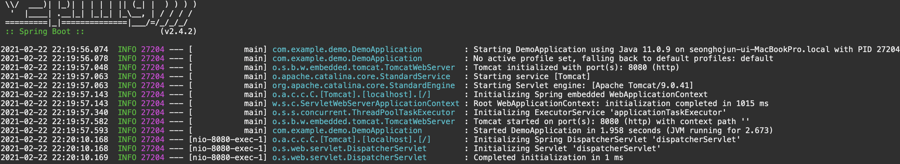
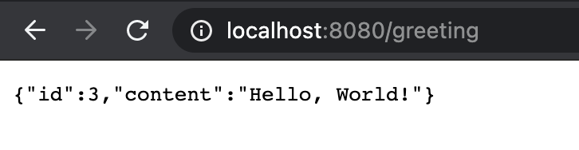
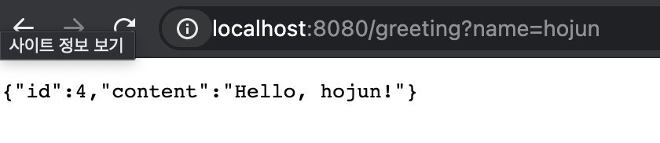

# Building a RESTful Web Service

이 문서 [다음 문서](https://spring.io/guides/gs/rest-service/)를 실습하는 내용이다.


## 목적

```http://localhost:8080/greeting``` 에 접속했을때,

```json
{"id":1,"content":"Hello, World!"}
```

위와 같은 JSON 응답을 받도록하는 간단한 Restful한 웹 서비스를 만들려고한다.

이때, name 파라미터를 요청에 넣으면, 그에 맞는 문장을 만들어서 돌려주도록 한다.

```http://localhost:8080/greeting?name=User``` 에 대해서는,

```json
{"id":1,"content":"Hello, User!"}
```

위와 같은 응답을 준다.


## 시작

[Spring Initializr](https://start.spring.io/)를 사용하거나, STS를 사용하여 데모 프로젝트를 생성한다.

내 경우에는 Maven을 이용할 것이며, 아래와 같은 파일이 만들어진다.

```xml
<?xml version="1.0" encoding="UTF-8"?>
<project xmlns="http://maven.apache.org/POM/4.0.0" xmlns:xsi="http://www.w3.org/2001/XMLSchema-instance"
	xsi:schemaLocation="http://maven.apache.org/POM/4.0.0 https://maven.apache.org/xsd/maven-4.0.0.xsd">
	<modelVersion>4.0.0</modelVersion>
	<parent>
		<groupId>org.springframework.boot</groupId>
		<artifactId>spring-boot-starter-parent</artifactId>
		<version>2.4.2</version>
		<relativePath/> <!-- lookup parent from repository -->
	</parent>
	<groupId>com.example</groupId>
	<artifactId>demo</artifactId>
	<version>0.0.1-SNAPSHOT</version>
	<name>demo</name>
	<description>Demo project for Spring Boot</description>
	<properties>
		<java.version>11</java.version>
	</properties>
	<dependencies>
		<dependency>
			<groupId>org.springframework.boot</groupId>
			<artifactId>spring-boot-starter-web</artifactId>
		</dependency>

		<dependency>
			<groupId>org.springframework.boot</groupId>
			<artifactId>spring-boot-starter-test</artifactId>
			<scope>test</scope>
		</dependency>
	</dependencies>

	<build>
		<plugins>
			<plugin>
				<groupId>org.springframework.boot</groupId>
				<artifactId>spring-boot-maven-plugin</artifactId>
			</plugin>
		</plugins>
	</build>

</project>

```


## Resource Representation Class 만들기.

/greeting 에 대한 GET 요청을 처리하고, 선택적으로 name 파라미터를 처리할 수 있는 서비스를 만들 것이다.

요청은 항상 200 OK를 리턴해야하고 아래와 같은 형태의 결과값을 보여야 한다.

```json
{
    "id": 1,
    "content": "Hello, World!"
}
```


이를 나타내기 위해서 POJO 스타일의 자바 클래스를 하나 선언한다.

위치는 src/main/java/com/example/demo/Greeting.java이다.

```java
package com.example.restservice;

public class Greeting {

	private final long id;
	private final String content;

	public Greeting(long id, String content) {
		this.id = id;
		this.content = content;
	}

	public long getId() {
		return id;
	}

	public String getContent() {
		return content;
	}
}
```

위 객체를 Jackson JSON 라이브러리를 사용하여 자동으로 JSON로 변환할 것이다.

Jackson JSON 라이브러리를 web starter에 자동으로 포함된다.


## Resource Controller 만들기

Restful web services를 만들기 위한 스프링의 전략은, HTTP 요청을 컨트롤러에서 핸들링 하는 것이다.

그런 컴포넌트들은 @RestController 어노테이션을 가진다.

src/main/java/com/example/demo/GreetingController.java 를 만들고 GET(/greeting) 요청을 처리하도록 해보자.

```java
package com.example.demo;

import java.util.concurrent.atomic.AtomicLong;

import org.springframework.web.bind.annotation.GetMapping;
import org.springframework.web.bind.annotation.RequestParam;
import org.springframework.web.bind.annotation.RestController;

@RestController
public class GreetingController {
	private static final String template = "Hello, %s!";
	private final AtomicLong counter = new AtomicLong();
	
	@GetMapping("/greeting")
	public Greeting greeting(@RequestParam(value = "name", defaultValue = "World")String name) {
		return new Greeting(counter.incrementAndGet(), String.format(template, name));
	}
}

```

@RestController 어노테이션으로 이 클래스가 HTTP 요청을 처리하는 컨트롤러임을 나타내자.

@GetMapping("/greeting") 어노테이션은 다음 메소드가 "/greeting" GET 요청을 처리함을 나타낸다.

@PostMapping 어노테이션을 사용하거나, @RequestMapping(method=?) 형태의 어노테이션도 사용할 수 있다.


@RequestParam은 query string의 name 파라미터를 greeting 메서드의 name 매개변수에 넣어준다. 값이 지정되어 있지 않은 경우, defaultValue로 지정된 값이 들어가게 된다. 

메서드는 이전에 선언한 Greeting 클래스를 이용해 객체를 만들어 리턴해 주는데, 매 생성시마다 새로운 아이디를 부여할 수 있도록 AtomicLong 클래스를 활용하고, name 매개변수로 Content를 만들어 넣어준다.


## 실행


실행하면 아래와 같이 톰캣서버와 dispatcherServlet 이라는게 초기화되며 시작되는걸 볼 수 있다.



이후, localhost:8080/greeting 에 접속하면 아래와 같이 정상적인 결과를 만날 수 있다.



queryString으로 name 값을 주면 아래와 같이 결과가 나온다.



매 요청마다 id 값이 1씩 증가함을 볼 수 있다.


## 설명

전통적인 MVC controller와 RESTful web service controller의 차이점은 전자가 HTTP 응답 바디를 만드는 것이다.  후자는 HTML과 같은 뷰 데이터를 만들다기 보다는 오브젝트를 JSON 형태로 나타내 준다.

@RestController 어노테이션은 view 대신에 도메인 오브젝트를 만들어준다. 이 어노테이션은 @Controllerdhk @ResponseBody 어노테이션을 포함하는 것과 같다. 여기서 반환한 Greeting 객체는 반드시 JSON로 변환되어야 하는데, 스프링의 HTTP message convert가 알아서 해준다. Jackson 2가 classpath에 있고 스프링의 MappingJackson2HttpMessageConvert가 자동으로  Greeting 인스턴스를 JSON으로 바꿔주기 때문이다.


```java
package com.example.demo;

import org.springframework.boot.SpringApplication;
import org.springframework.boot.autoconfigure.SpringBootApplication;
import org.springframework.web.bind.annotation.GetMapping;
import org.springframework.web.bind.annotation.RequestParam;
import org.springframework.web.bind.annotation.RestController;

@SpringBootApplication
public class DemoApplication {

	public static void main(String[] args) {
		SpringApplication.run(DemoApplication.class, args);
	}
}
```

@SpringBootApplication 은 다음과 같은 어노테이션을 한번에 모두 포함시켜주는 편리한 어노테이션이다.

* @Configuration: Application context를 위한 빈정의의 소스로 이 클래스를 태그한다.
* @EnableAutoConfiguration: Spring Boot에게 classpath, 다른 beans, 다양한 프로퍼티 들로부터 빈을 추가하라고 명령한다. 예를 들어, spring-webmvc가 클래스 패스에 있으면, 이 어노테이션은 이 어플리케이션이 웹 어플리  케이션임을 나타내고 DispatcherServlet 을 셋팅하는 등의 중요한 key를 활성화한다.
* @ComponentScan: 스프링에게 패키지에서 다른 components, configuration, service를 찾도록하고, 컨트롤러를 찾는다.

main() 에서 SpringApllication.run() 메서드는 어플리케이션을 띄운다. 이 애플리케이션에서는 XML 설정을 한줄도 하지않았고, web.xml 파일도 없다. 이 웹 어플리케이션은 100% 순수한 자바 코드이다. 사용자는 어떤 설정 하지 않았다.


## 실행 가능한 JAR 파일 빌드하기.

모든 필요한 의존성,클래스, 리소스들과 함께 JAR file을 빌드하고 실행할 수 있다. jar 파일을 빌드하면 서비스를 운반, 버전, 배포하기 쉽다.

gradle 을 이용한다면 ./gradlew bootRun 으로 실행가능하고 ./gradlew build로 jar 파일을 생성할 수 있다.

Jar 파일 생성후, 아래 명령으로 실행할 수 있다.

```
java -jar build/libs/gs-rest-service-0.1.0.jar
```


Maven을 사용하면 ./mvnw clean package로 jar file을 빌드할 수 있고, 아래 명령을 통해 실행 가능하다.

```
java -jar target/gs-rest-service-0.1.0.jar
```


## 느낀점

영어로 된 문서를 실습해보면서 옮겨 적는데 영어실력의 부족함을 느낀다. 그래도 원서가 주는 이해감이 상당하다.

