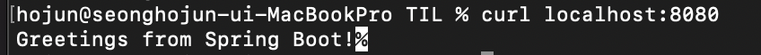
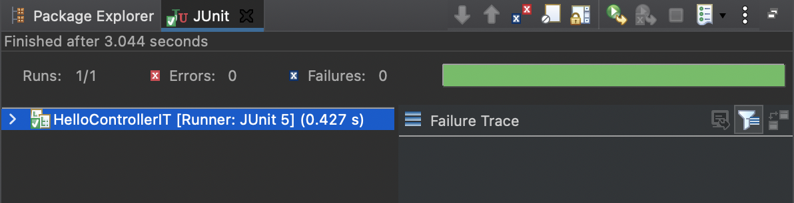
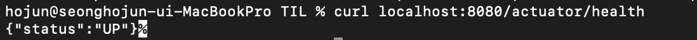
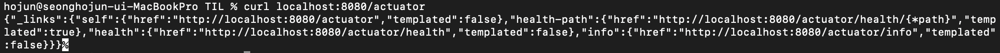
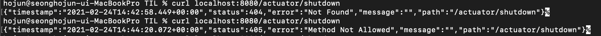
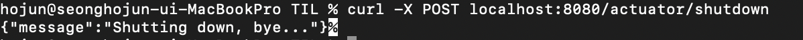
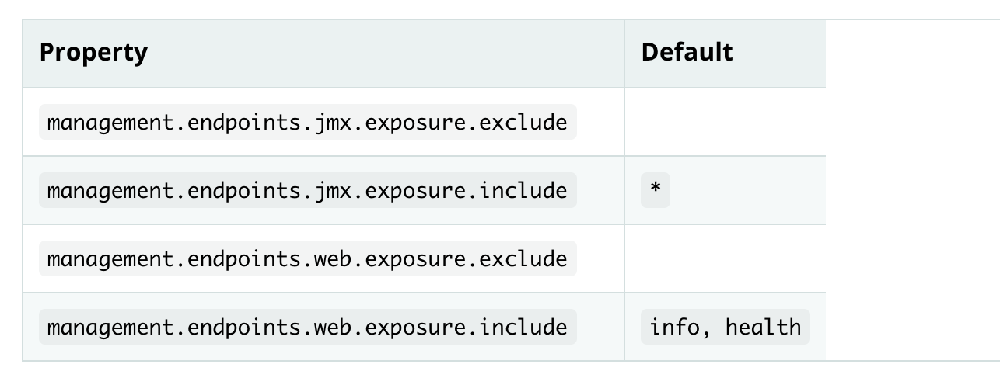
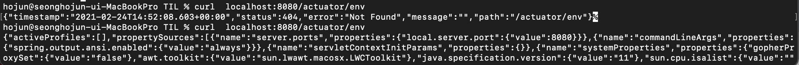

# Building an Application with Spring Boot

이 문서 [다음 문서](https://spring.io/guides/gs/spring-boot/)를 실습하는 내용이다. 영어를 해석에 문제가 많으니 유의바란다.


## 목적

스프링 부트는 어플리케이션을 만드는 가장 빠른 방법을 제공해준다. 또한 스프링 부트는 classpath와 설정된 빈을 보고 합리적인 추론을 통해 사용자가 놓친것을 추가해 준다. 스프링을 사용하면 사용자는 비지니스적인 특징에 더욱 집중할 수 있고 infrastructure에 적게 신경써도 된다.

이 예제에서는 스프링 부트가 할 수 있는 아래와 같은 것들을 보여준다.

* 스프링 MVC가 classpath에 있을때, 대부분 필요한 여러개의 특정 빈들이 있는데 그것들을 스프링 부트가 자동으로 추가해준다. 또한, 스프링 MVC는 서블릿 컨테이너를 필요로하는데 이것도 스프링 부트가 자동으로 내장된 톰켓을 설정해준다.
* Jetty가 classpath에 있을때에는 사용자가 톰켓보다 내장된 Jetty를 사용하기 원할 것이고, 스프링 부트는 이를 처리해준다.
* Thymeleaf가 classpath에 있을때에는 일련의 빈들이 반드시 Application context에 등록되어야 하는데, 스프링 부트가 이를 자동으로 해준다.


이것들은  스프링 부트가 제공하는 자동 설정중 일부에 불과하다. 그러면서도 스프링 부트는 사용자를 방해하지 않는다. 예를들어, Thymeleaf가 path에 있을때, 스프링 부트는 자동으로 SpringTemplateEngine을 사용자의 Application context에 넣어준다. 하지만 만약 사용자가 스스로의 SpringTemplateEngine을 특정 설정으로 등록했을때에는 스프링 부트는 자동 등록을 하지않는다. 이는 사용자가 아주 적은 노력으로 원하는걸 할수 있게 해준다.

스프링 부트는 코드를 만들거나 사용자의 파일을 수정하지 않는다. 사용자가 어플리케이션을 시작할때 스프링 부트는 동적으로 빈과 셋팅들을 구성하고 application contex에 적용한다.


## 시작

STS등을 이용해 스프링 스타터 앱을 만든다. 스프링 웹 의존성을 추가해준다.

src/main/java/패키지/HelloController.java 파일 을 만들고 아래와 같은 코드를 작성한다.

```java
package com.example.springboot;

import org.springframework.web.bind.annotation.RestController;
import org.springframework.web.bind.annotation.RequestMapping;

@RestController
public class HelloController {

	@RequestMapping("/")
	public String index() {
		return "Greetings from Spring Boot!";
	}
}		
```

이 클래스는 @RestController로 표시되어있다. 이는 스프링 MVC를 사용하고 웹 요청을 처리함을 의미한다.

@RequestMapping은 '/' 에 대한 요청을 index 메서드로 연결해준다. 웹 브라우저나 curl 등을 이용해서 접근했을때 이 메서드는 순수한 텍스트를 리턴한다. 왜냐하면 @RestController 는 @Controller와 @ResponseBody를 합성해 놓은 것이기 때문이다. 두개의 어노테이션은 웹 요청에 대한 결과가 뷰가 아닌 데이터를 반환함을 의미한다.


## Application Class 수정

Application 클래스를 아래와 같이 수정한다.

```java
package com.example.springboot;

import java.util.Arrays;

import org.springframework.boot.CommandLineRunner;
import org.springframework.boot.SpringApplication;
import org.springframework.boot.autoconfigure.SpringBootApplication;
import org.springframework.context.ApplicationContext;
import org.springframework.context.annotation.Bean;

@SpringBootApplication
public class Application {

	public static void main(String[] args) {
		SpringApplication.run(Application.class, args);
	}

	@Bean
	public CommandLineRunner commandLineRunner(ApplicationContext ctx) {
		return args -> {

			System.out.println("Let's inspect the beans provided by Spring Boot:");

			String[] beanNames = ctx.getBeanDefinitionNames();
			Arrays.sort(beanNames);
			for (String beanName : beanNames) {
				System.out.println(beanName);
			}

		};
	}

}
```

commandLineRunner 메소드는 어플리케이션이 시작된 뒤 실행된다. 여기서는 ApplicationContext에 등록된 모든 빈, 사용자가 생성했거나 자동으로 생성된 빈, 들 가져와 정렬해서 프린트해준다. 


## 실행


```
./mvnw spring-boot:run (Maven)
```

위 명령을 통하거나, STS 등 IDE를 통해 앱을 실행하면 아래와 같은 결과를 볼 수 있다.


```
Let's inspect the beans provided by Spring Boot:
application
beanNameHandlerMapping
defaultServletHandlerMapping
dispatcherServlet
embeddedServletContainerCustomizerBeanPostProcessor
handlerExceptionResolver
helloController
httpRequestHandlerAdapter
messageSource
mvcContentNegotiationManager
mvcConversionService
mvcValidator
org.springframework.boot.autoconfigure.MessageSourceAutoConfiguration
org.springframework.boot.autoconfigure.PropertyPlaceholderAutoConfiguration
org.springframework.boot.autoconfigure.web.EmbeddedServletContainerAutoConfiguration
org.springframework.boot.autoconfigure.web.EmbeddedServletContainerAutoConfiguration$DispatcherServletConfiguration
org.springframework.boot.autoconfigure.web.EmbeddedServletContainerAutoConfiguration$EmbeddedTomcat
org.springframework.boot.autoconfigure.web.ServerPropertiesAutoConfiguration
org.springframework.boot.context.embedded.properties.ServerProperties
org.springframework.context.annotation.ConfigurationClassPostProcessor.enhancedConfigurationProcessor
org.springframework.context.annotation.ConfigurationClassPostProcessor.importAwareProcessor
org.springframework.context.annotation.internalAutowiredAnnotationProcessor
org.springframework.context.annotation.internalCommonAnnotationProcessor
org.springframework.context.annotation.internalConfigurationAnnotationProcessor
org.springframework.context.annotation.internalRequiredAnnotationProcessor
org.springframework.web.servlet.config.annotation.DelegatingWebMvcConfiguration
propertySourcesBinder
propertySourcesPlaceholderConfigurer
requestMappingHandlerAdapter
requestMappingHandlerMapping
resourceHandlerMapping
simpleControllerHandlerAdapter
tomcatEmbeddedServletContainerFactory
viewControllerHandlerMapping
```

Application context에 등록된 여러 빈을 볼 수 있는데, 그중에는 org.springframework.boot.autoconfigure  빈과 tomcatEmbeddedServletContainerFactory 빈을 확인할 수 있다. 정말 많은 빈들이 자동등록되는 듯하다.




이제 localhost:8080에 접속해보면 앞서 작성했던 HelloController 의 index 함수의 반환값을 받아 볼 수 있다.


## 단위 테스트(Unit Test)

우리가 추가한 endpoint에 대한 테스트를 진행하고 싶다면, 스프링 테스트 그를 위 장치를 제공해준다.

```xml
<dependency>
	<groupId>org.springframework.boot</groupId>
	<artifactId>spring-boot-starter-test</artifactId>
	<scope>test</scope>
</dependency>
```

pom.xml을 보게 되면 위와같은 부분이 있는데 이 부분이 테스트를 위한 의존성을 추가한 부분이다.

이제 간단한 유닛 테스트를 작성해보자. 

우리의 endpoint에 대해 servlet request, response를 mock 해주는 테스트를 아래와 같이 작성한다.


```java
package com.example.springboot;

import static org.hamcrest.Matchers.equalTo;
import static org.springframework.test.web.servlet.result.MockMvcResultMatchers.content;
import static org.springframework.test.web.servlet.result.MockMvcResultMatchers.status;

import org.junit.jupiter.api.Test;

import org.springframework.beans.factory.annotation.Autowired;
import org.springframework.boot.test.autoconfigure.web.servlet.AutoConfigureMockMvc;
import org.springframework.boot.test.context.SpringBootTest;
import org.springframework.http.MediaType;
import org.springframework.test.web.servlet.MockMvc;
import org.springframework.test.web.servlet.request.MockMvcRequestBuilders;

@SpringBootTest
@AutoConfigureMockMvc
public class HelloControllerTest {

	@Autowired
	private MockMvc mvc;

	@Test
	public void getHello() throws Exception {
		mvc.perform(MockMvcRequestBuilders.get("/").accept(MediaType.APPLICATION_JSON))
				.andExpect(status().isOk())
				.andExpect(content().string(equalTo("Greetings from Spring Boot!")));
	}
}
```

MockMvc는 Spring Test에서 왔고, DispatcherServlet에게 HTTP 요청을 보내 결과에 대한 기댓값을 설정할 수 있게 해주는 편리한 builder를 제공해준다.

@SpringBootTest 어노테이션을 적용하면 우리는 전체 Application context가 만들어지기를 요청하는 것이다. SpringBootTest와 AutoConfigureMockMvc는 MockMvc 주입에 사용된다. @SpringBootTest 대신 @WebMvcTest를 사용하면 스프링 부트에게 웹 레이어의 context만이 만들어지도록 요청할 수 있다. 두가지 경우 모두 스프링 부트가 자동으로 사용자의 어플리케이션의 메인 클래스를 위치 시키게끔 시도한다. 사용자가 이를 override하거나 다르게 바꿀수 있다.


실행시, 위와 같은 결과를 만들 수 있다.

# Full Stack Integration Test


 Http request cycle을 mock 하는 것외에도 스프링 부트는 간단한 full stack 통합 테스트를 작성하도록 도와준다. 아래와 같이 HelloControllerIT 클래스를 만들어 보자.


```java
package com.example.springboot;

import static org.assertj.core.api.Assertions.*;

import java.net.URL;

import org.junit.jupiter.api.BeforeEach;
import org.junit.jupiter.api.Test;

import org.springframework.beans.factory.annotation.Autowired;
import org.springframework.boot.test.context.SpringBootTest;
import org.springframework.boot.test.web.client.TestRestTemplate;
import org.springframework.boot.web.server.LocalServerPort;
import org.springframework.http.ResponseEntity;

@SpringBootTest(webEnvironment = SpringBootTest.WebEnvironment.RANDOM_PORT)
public class HelloControllerIT {

	@LocalServerPort
	private int port;

	private URL base;

	@Autowired
	private TestRestTemplate template;

    @BeforeEach
    public void setUp() throws Exception {
        this.base = new URL("http://localhost:" + port + "/");
    }

    @Test
    public void getHello() throws Exception {
        ResponseEntity<String> response = template.getForEntity(base.toString(),
                String.class);
        assertThat(response.getBody()).isEqualTo("Greetings from Spring Boot!");
    }
}
```

위 코드를 실행하면, 내장 서버가 랜덤한 포트에 실행된다. @SpringBootTest에 옵션을 주었기 때문이다. 그리고 랜덤한 포트는 @LocalServerPort 어노테이션이 붙은 정수형 멤버 변수에 저장되게 된다. 그리고 TestRestTemplate을 주입받아, 포트를 이용해 만든 URL로 요청을 보내면 ResponseEntity 형태의 응답을 받을 수 있다.

응답의 Body 값이 잘 왔는지 확인 하는것으로 테스트가 마무리 된다.

실행결과는 아래와 같다.




## Product 등급의 서비스 추가

만약 비지니스를 위한 웹사이트를 만드는 중이라면 아마도 관리 서비스를 추가할 필요가 있을 것이다. 스프링 부트는 그런 몇가지의 서비스를  actuator module과 함께 제공해준다. (예를들면 서비스의 상태나 감사, 빈즈 같은 것들) 


```xml
<dependency>
	<groupId>org.springframework.boot</groupId>
	<artifactId>spring-boot-starter-actuator</artifactId>
</dependency>
```

위와같은 의존성을 pom.xml에 추가해주자.

그리고 어플리케이션을 재시작해보자.

```
./mvnw spring-boot:run
```

새로운 RESTful endpoint가 어플리케이션에 추가됨을 확인해보자.  이것들은 스프링 부트가 제공해주는 관리 서비스들이다. 아래와 같은 리스트는 전형적인 결과를 보여준다


```
management.endpoint.configprops-org.springframework.boot.actuate.autoconfigure.context.properties.ConfigurationPropertiesReportEndpointProperties
management.endpoint.env-org.springframework.boot.actuate.autoconfigure.env.EnvironmentEndpointProperties
management.endpoint.health-org.springframework.boot.actuate.autoconfigure.health.HealthEndpointProperties
management.endpoint.logfile-org.springframework.boot.actuate.autoconfigure.logging.LogFileWebEndpointProperties
management.endpoints.jmx-org.springframework.boot.actuate.autoconfigure.endpoint.jmx.JmxEndpointProperties
management.endpoints.web-org.springframework.boot.actuate.autoconfigure.endpoint.web.WebEndpointProperties
management.endpoints.web.cors-org.springframework.boot.actuate.autoconfigure.endpoint.web.CorsEndpointProperties
management.health.status-org.springframework.boot.actuate.autoconfigure.health.HealthIndicatorProperties
management.info-org.springframework.boot.actuate.autoconfigure.info.InfoContributorProperties
management.metrics-org.springframework.boot.actuate.autoconfigure.metrics.MetricsProperties
management.metrics.export.simple-org.springframework.boot.actuate.autoconfigure.metrics.export.simple.SimpleProperties
management.server-org.springframework.boot.actuate.autoconfigure.web.server.ManagementServerProperties
management.trace.http-org.springframework.boot.actuate.autoconfigure.trace.http.HttpTraceProperties
```

actuator는 다음 3가지를 노출한다.

* actuator/health
* actuator/info
* actuator


다음과 같은 요청을 보내면 위에 추가된 actuator를 확인할 수 있다.






그리고 /actuator/shutdown 엔드포인트도 있는데 이걸 활성화 하려면 application.properties 파일에 다음과 같은 문구를 추가해줘야한다.

```properties
management.endpoint.shutdown.enabled=true
management.endpoints.web.exposure.include=health,info,shutdown
```

설정을 추가해주면 아래와 같이 Not Found가 Method Not Allowed로 바뀐다.



아래와 같이 포스트 메서드로 shutdown 요청을 보내면 해당 문구와 함께 어플리케이션이 종료된다.




actuator에 대한 내용은 [다음](https://docs.spring.io/spring-boot/docs/2.4.2/reference/htmlsingle/#production-ready-endpoints)링크에서 종류를 확인할 수 있다. 다른 여러 명령어들은 웹환경에서는 안되고 JMX라는 것을 이용해야한다.

웹에 대해서도 허용해주려면 아래와 같은 설정을 해주면 된다고한다.




Application.properties 파일에 아래 설정을 추가해보았다.

```
management.endpoints.web.exposure.include=*
```

그랬더니 Not Found 였던 env에 대한 actuator 요청이 작동하는걸 볼 수 있었다.



근데 너무 읽기 힘든 형태였따..  여기까지만 해보자.


## 느낀점

뭔가 띄엄띄엄 있는 정보들을 수박 겉햛기 식으로 본듯 하다.

@RestController와 @RequestMapping을 통해 간단하게 RESTful API를 정의해보았고 CommandLineRunner를 통해 어플리케이션 시작후 스프링 부트가 자동으로 추가한 모든 빈의 이름을 출력해보기도 하였다.

그리고 단위 테스트를 진행하기위해 @SpringBootTest, @AutoConfigureMockMvc를 이용해 목 서블릿으로 요청과 응답을 테스트 해보았다. MockMvc를 @Autowired를 통해 주입받고 perform 메서드로 MockMvcRequestBuilders에 지정된 결과값을 비교해보았다. 이때 @SpringBootTest 는 모든 application context를 생성하는데 @WebMvcTest 를 쓰면 웹 레이어에 대한 application context만 생성한다고 한다. 그리고 단위 테스트가 아닌 full-stack 통합 테스트를 진행할 수도있었다. @SpringBootTest(webEnvironment = SpringBootTest.WebEnvironment.RANDOM_PORT) 와 같이 어노테이션에 webEnvironment 를 설정해주면 내장 톰켓이 랜덤 포트에 시작되고 테스트 되는 것을 보았다. 생성된 서버의 포트를 받아와 요청을 보낼 URL을 만들고 테스트 요청을 보내 결과를 가져와 비교해보았다.

TestRestTemplate을 @Autowired를 통해 주입받고 그를 이용해 요청을 받을 수 있었다. 


그리고 Product 등급의 서비스를 손쉽게 추가할 수 있었다. actuator를 의존성에 추가하고 적절한 설정을 해주면 어플리케이션의 상태를 보거나 종료하는등의 다양한 endpoint를 자동으로 만들어 주었다.