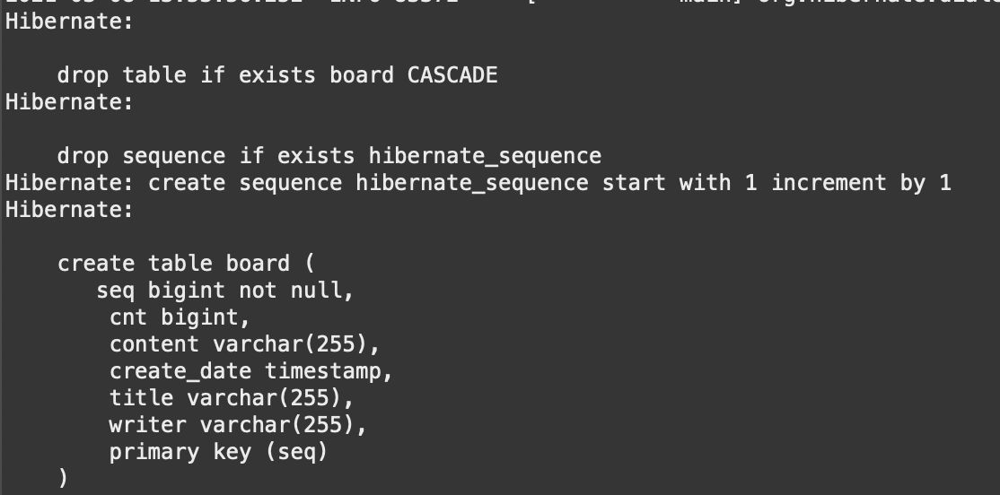
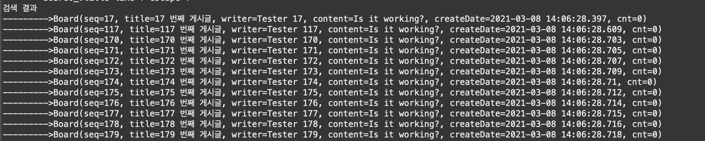
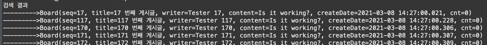
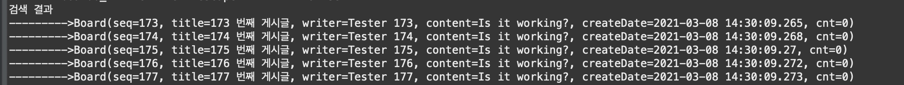
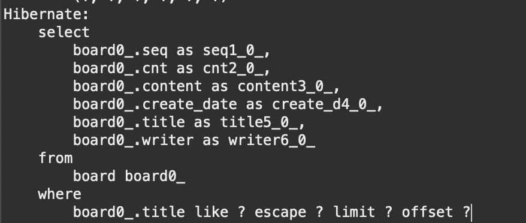
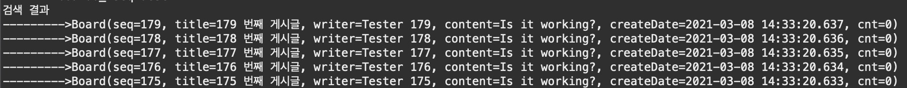
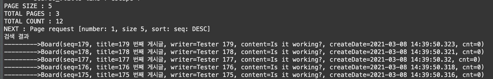

# 스프링 데이터 JPA

스프링 부트는 JPA 연동에 필요한 라이브러리들과 복잡한 XML 설정을 자동으로 처리하기위해 JPA 스타터를 제공한다.


## 실습

먼저 H2 데이터 베이스를 준비하자. 그리고

새로운 스프링 부트 스타터 프로젝트를 생성하고 JPA, H2, DevTool, Lombok, Web 의존성을 추가하자. 그리고 데이터 소스를 비롯한 JPA 설정을 추가하기 위해 src/main/resource 소스 폴더에 있는 application.properties 파일을 열어서 다음 설정을 추가하자.

```properties
spring.datasource.driver-class-name=org.h2.Driver
spring.datasource.url=jdbc:h2:tcp://localhost/~/test
spring.datasource.username=sa
spring.datasource.password=

spring.jpa.hibernate.ddl-auto=update
spring.jpa.generate-ddl=false
spring.jpa.show-sql=true
spring.jpa.database-platform=org.hibernate.dialect.H2Dialect
spring.jpa.properties.hibernate.format_sql=true

logging.level.org.hibernate=info
```


엔티티 매핑 클래스를 아래와 같이 추가하자.

```java
package com.hojun.chap5.domain;

import java.util.Date;

import javax.persistence.Entity;
import javax.persistence.GeneratedValue;
import javax.persistence.Id;
import javax.persistence.Temporal;
import javax.persistence.TemporalType;

import lombok.Data;

@Data
@Entity
public class Board {
	@Id @GeneratedValue
	private Long seq;
	private String title;
	private String writer;
	private String content;
	@Temporal(value = TemporalType.TIMESTAMP)
	private Date createDate;
	private Long cnt;
}
```

그리고 앱을 실행시켜보면 아래와 같이 테이블이 생성되는 것을 알 수 있다.




데이터 접근을 위해 Respository 인터페이스를 작성해보자. Repository는 기존의 DAO와 동일한 개념으로, 비지니스 클래스에서 이 Repository를 이용하여 실질적인 데이터베이스 연동 처리를 한다. 

Repository -> CrudRepository -> PagingAndSortingRepository -> JpaRepository 와 같은 상속 구조를 가지고, 앞의 3개는 Spring Data 모듈에서 제공하고 JpaRepository는 Spring Data JPA 에서 추가로 제공해주는 인터페이스다. 일반적으로는 CrudRepository를 주로 사용한다. 검색기능이나 페이징 처리를 할때에는 PagingAndSortingRepository를 사용하면된다.


```java
package com.hojun.chap5.persistence;

import java.util.List;

import org.springframework.data.repository.CrudRepository;

import com.hojun.chap5.domain.Board;

public interface BoardRepository extends CrudRepository<Board, Long> {
	List<Board> findByTitle(String title);
	List<Board> findByTitleContaining(String content);
}

```

CrudRepository는 엔티티의 클래스 타입과 식별자(@Id) 타입을 제네릭으로 지정해야한다. 인터페이스만 정의하면 스프링 데이터 JPA가 구현 객체를 자동으로 생성해준다. 생성되는 메소드는 아래와 같다.

- long count()
- void delete(ID)
- void delete(iterable<? Extends T>)
- boolean exists(ID)
- Iterable\<T\> findAll()
- T findOne(ID)
- \<S extends T\> Iterable\<S\> save(iteralbe\<S\>)
- \<S extends T\>S save\<S entity\>


### 테스트

CrudRepository 인터페이스를 사용하기위해 아래와 같이 테스트를 작성해보자.


```java
package com.hojun.chap5;

import java.util.Date;
import java.util.List;

import org.aspectj.lang.annotation.Before;
import org.junit.jupiter.api.BeforeEach;
import org.junit.jupiter.api.Test;
import org.springframework.beans.factory.annotation.Autowired;
import org.springframework.boot.test.context.SpringBootTest;
import org.springframework.test.annotation.Rollback;
import org.springframework.transaction.annotation.Transactional;

import com.hojun.chap5.domain.Board;
import com.hojun.chap5.persistence.BoardRepository;

@SpringBootTest
//@Transactional
public class BoardRepositoryTest {
	@Autowired
	private BoardRepository boardRepository;
//	
	@BeforeEach
	public void setup() {
		for(int i = 1; i <= 200; i++) {
			Board board = new Board();
			board.setTitle(i + " 번째 게시글");
			board.setWriter("Tester " + i);
			board.setContent("Is it working?");
			board.setCreateDate(new Date());
			board.setCnt(0L);
			boardRepository.save(board);
		}
	}
	
	@Test
	public void testFindByTitle() {
		List<Board> boardList = boardRepository.findByTitleContaining("17");
		System.out.println("검색 결과");
		for(Board board : boardList) {
			System.out.println("--------->" + board.toString());
		}
	}
}
```

Repository 를 @Autowired를 통해 주입받아 사용할 수 있다. 200개의 게시글을 등록하고 Title을 기반으로 검색해서 출력할 수 있다.




위와 같은 결과를 볼수 있다.


## 페이징과 정렬 처리

페이징 처리를 위해 아래와 같이 findByTitleContaining 메서드에 Pageable 인자를 받도록 추가해보자.

```java
package com.hojun.chap5.persistence;

import java.util.List;

import org.springframework.data.domain.Pageable;
import org.springframework.data.repository.CrudRepository;

import com.hojun.chap5.domain.Board;

public interface BoardRepository extends CrudRepository<Board, Long> {
	List<Board> findByTitle(String title);
	List<Board> findByTitleContaining(String content, Pageable paging);
}
```


테스트에서도 paging을 넣어주자.

```java
package com.hojun.chap5;

@SpringBootTest
//@Transactional
public class BoardRepositoryTest {
	@Autowired
	private BoardRepository boardRepository;
	
	@BeforeEach
	public void setup() {
		for(int i = 1; i <= 200; i++) {
			Board board = new Board();
			board.setTitle(i + " 번째 게시글");
			board.setWriter("Tester " + i);
			board.setContent("Is it working?");
			board.setCreateDate(new Date());
			board.setCnt(0L);
			boardRepository.save(board);
		}
	}
	
	
	@Test
	public void testFindByTitle() {
		Pageable paging = PageRequest.of(0, 5);
		List<Board> boardList = boardRepository.findByTitleContaining("17", paging);
		System.out.println("검색 결과");
		for(Board board : boardList) {
			System.out.println("--------->" + board.toString());
		}
	}
}
```

Pageable을 PageRequest로 생성해서 넣어준다.



실행 결과 위와같이 페이지된 5개의 항목이 나왔다.


```java
@Test
	public void testFindByTitle() {
		Pageable paging = PageRequest.of(1, 5);
		List<Board> boardList = boardRepository.findByTitleContaining("17", paging);
		System.out.println("검색 결과");
		for(Board board : boardList) {
			System.out.println("--------->" + board.toString());
		}
	}
```

첫번째 페이지를 출력하도록 해보자.



위와같이 다음 페이지가 출력된것을 볼 수 있다.



h2이기 떄문에 limit 예약어를 사용한 SQL이 생성되어 실행되었다. 만약 오라클을 사용했다면 FROM 절에 복잡한 서브쿼리가 생성되었을 것이다.


```java
@Test
	public void testFindByTitle() {
		Pageable paging = PageRequest.of(0, 5, Sort.Direction.DESC, "seq");
		List<Board> boardList = boardRepository.findByTitleContaining("17", paging);
		System.out.println("검색 결과");
		for(Board board : boardList) {
			System.out.println("--------->" + board.toString());
		}
	}
```

위와 같이 Pageable를 생성할때 PageRequest에 Sort.Direction 을 주게되면 소팅할 수있다.




seq 가 높은 순으로 정렬되고 페이징된 결과를 얻을 수 있다.


### Page\<T\> 타입 사용하기

검색 결과를 List\<T\>으로 받기 보다는 Page\<T\> 을 이용하는 것이 좋다. Page\<T\> 객체는 페이징 처리에서 사용할 수 있는 다양한 정보들을 추가로 제공하기 때문이다.

```java

public interface BoardRepository extends CrudRepository<Board, Long> {
	Page<Board> findByTitleContaining(String content, Pageable paging);
}
```

인터페이스를 위와같이 변경해주고 테스트도 조금 변경해준다.

```java
	@Test
	public void testFindByTitle() {
		Pageable paging = PageRequest.of(0, 5, Sort.Direction.DESC, "seq");
		Page<Board> pageInfo = boardRepository.findByTitleContaining("17", paging);
		
		
		System.out.println("PAGE SIZE : " + pageInfo.getSize());
		System.out.println("TOTAL PAGES : " + pageInfo.getTotalPages());
		System.out.println("TOTAL COUNT : " + pageInfo.getTotalElements());
		System.out.println("NEXT : " + pageInfo.nextPageable());
		
		List<Board> boardList = pageInfo.getContent();
		System.out.println("검색 결과");
		for(Board board : boardList) {
			System.out.println("--------->" + board.toString());
		}
	}
```

아래와 같이 페이지의 정보를 볼 수 있다.

