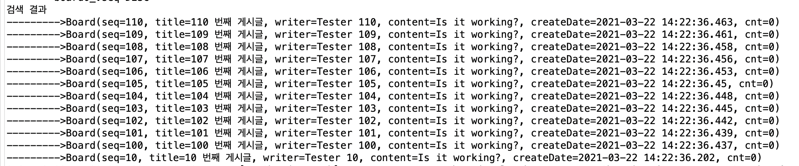
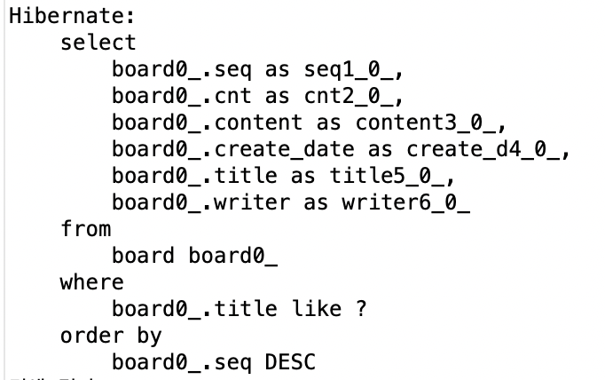
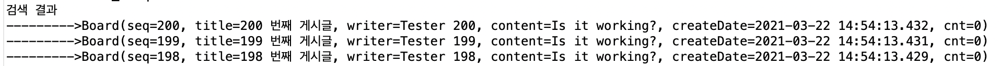

# 스프링 데이터 JPA

스프링 부트는 JPA 연동에 필요한 라이브러리들과 복잡한 XML 설정을 자동으로 처리하기위해 JPA 스타터를 제공한다.


## 실습

먼저 H2 데이터 베이스를 준비하자. 그리고

새로운 스프링 부트 스타터 프로젝트를 생성하고 JPA, H2, DevTool, Lombok, Web 의존성을 추가하자. 그리고 데이터 소스를 비롯한 JPA 설정을 추가하기 위해 src/main/resource 소스 폴더에 있는 application.properties 파일을 열어서 다음 설정을 추가하자.

```properties
spring.datasource.driver-class-name=org.h2.Driver
spring.datasource.url=jdbc:h2:tcp://localhost/~/test
spring.datasource.username=sa
spring.datasource.password=

spring.jpa.hibernate.ddl-auto=update
spring.jpa.generate-ddl=false
spring.jpa.show-sql=true
spring.jpa.database-platform=org.hibernate.dialect.H2Dialect
spring.jpa.properties.hibernate.format_sql=true

logging.level.org.hibernate=info
```


엔티티 매핑 클래스를 아래와 같이 추가하자.

```java
package com.hojun.chap5.domain;

import java.util.Date;

import javax.persistence.Entity;
import javax.persistence.GeneratedValue;
import javax.persistence.Id;
import javax.persistence.Temporal;
import javax.persistence.TemporalType;

import lombok.Data;

@Data
@Entity
public class Board {
	@Id @GeneratedValue
	private Long seq;
	private String title;
	private String writer;
	private String content;
	@Temporal(value = TemporalType.TIMESTAMP)
	private Date createDate;
	private Long cnt;
}
```

그리고 앱을 실행시켜보면 아래와 같이 테이블이 생성되는 것을 알 수 있다.


데이터 접근을 위해 Respository 인터페이스를 작성해보자. Repository는 기존의 DAO와 동일한 개념으로, 비지니스 클래스에서 이 Repository를 이용하여 실질적인 데이터베이스 연동 처리를 한다. 

Repository -> CrudRepository -> PagingAndSortingRepository -> JpaRepository 와 같은 상속 구조를 가지고, 앞의 3개는 Spring Data 모듈에서 제공하고 JpaRepository는 Spring Data JPA 에서 추가로 제공해주는 인터페이스다. 일반적으로는 CrudRepository를 주로 사용한다. 검색기능이나 페이징 처리를 할때에는 PagingAndSortingRepository를 사용하면된다.


```java
package com.hojun.chap5.persistence;

import java.util.List;

import org.springframework.data.repository.CrudRepository;

import com.hojun.chap5.domain.Board;

public interface BoardRepository extends CrudRepository<Board, Long> {
	List<Board> findByTitle(String title);
	List<Board> findByTitleContaining(String content);
}

```

CrudRepository는 엔티티의 클래스 타입과 식별자(@Id) 타입을 제네릭으로 지정해야한다. 인터페이스만 정의하면 스프링 데이터 JPA가 구현 객체를 자동으로 생성해준다. 생성되는 메소드는 아래와 같다.

- long count()
- void delete(ID)
- void delete(iterable<? Extends T>)
- boolean exists(ID)
- Iterable\<T\> findAll()
- T findOne(ID)
- \<S extends T\> Iterable\<S\> save(iteralbe\<S\>)
- \<S extends T\>S save\<S entity\>


### 테스트

CrudRepository 인터페이스를 사용하기위해 아래와 같이 테스트를 작성해보자.


```java
package com.hojun.chap5;

import java.util.Date;
import java.util.List;

import org.aspectj.lang.annotation.Before;
import org.junit.jupiter.api.BeforeEach;
import org.junit.jupiter.api.Test;
import org.springframework.beans.factory.annotation.Autowired;
import org.springframework.boot.test.context.SpringBootTest;
import org.springframework.test.annotation.Rollback;
import org.springframework.transaction.annotation.Transactional;

import com.hojun.chap5.domain.Board;
import com.hojun.chap5.persistence.BoardRepository;

@SpringBootTest
//@Transactional
public class BoardRepositoryTest {
	@Autowired
	private BoardRepository boardRepository;
//	
	@BeforeEach
	public void setup() {
		for(int i = 1; i <= 200; i++) {
			Board board = new Board();
			board.setTitle(i + " 번째 게시글");
			board.setWriter("Tester " + i);
			board.setContent("Is it working?");
			board.setCreateDate(new Date());
			board.setCnt(0L);
			boardRepository.save(board);
		}
	}
	
	@Test
	public void testFindByTitle() {
		List<Board> boardList = boardRepository.findByTitleContaining("17");
		System.out.println("검색 결과");
		for(Board board : boardList) {
			System.out.println("--------->" + board.toString());
		}
	}
}
```

Repository 를 @Autowired를 통해 주입받아 사용할 수 있다. 200개의 게시글을 등록하고 Title을 기반으로 검색해서 출력할 수 있다.


위와 같은 결과를 볼수 있다.


## 페이징과 정렬 처리

페이징 처리를 위해 아래와 같이 findByTitleContaining 메서드에 Pageable 인자를 받도록 추가해보자.

```java
package com.hojun.chap5.persistence;

import java.util.List;

import org.springframework.data.domain.Pageable;
import org.springframework.data.repository.CrudRepository;

import com.hojun.chap5.domain.Board;

public interface BoardRepository extends CrudRepository<Board, Long> {
	List<Board> findByTitle(String title);
	List<Board> findByTitleContaining(String content, Pageable paging);
}
```


테스트에서도 paging을 넣어주자.

```java
package com.hojun.chap5;

@SpringBootTest
//@Transactional
public class BoardRepositoryTest {
	@Autowired
	private BoardRepository boardRepository;
	
	@BeforeEach
	public void setup() {
		for(int i = 1; i <= 200; i++) {
			Board board = new Board();
			board.setTitle(i + " 번째 게시글");
			board.setWriter("Tester " + i);
			board.setContent("Is it working?");
			board.setCreateDate(new Date());
			board.setCnt(0L);
			boardRepository.save(board);
		}
	}
	
	
	@Test
	public void testFindByTitle() {
		Pageable paging = PageRequest.of(0, 5);
		List<Board> boardList = boardRepository.findByTitleContaining("17", paging);
		System.out.println("검색 결과");
		for(Board board : boardList) {
			System.out.println("--------->" + board.toString());
		}
	}
}
```

Pageable을 PageRequest로 생성해서 넣어준다.


실행 결과 위와같이 페이지된 5개의 항목이 나왔다.


```java
@Test
	public void testFindByTitle() {
		Pageable paging = PageRequest.of(1, 5);
		List<Board> boardList = boardRepository.findByTitleContaining("17", paging);
		System.out.println("검색 결과");
		for(Board board : boardList) {
			System.out.println("--------->" + board.toString());
		}
	}
```

첫번째 페이지를 출력하도록 해보자.


위와같이 다음 페이지가 출력된것을 볼 수 있다.


h2이기 떄문에 limit 예약어를 사용한 SQL이 생성되어 실행되었다. 만약 오라클을 사용했다면 FROM 절에 복잡한 서브쿼리가 생성되었을 것이다.


```java
@Test
	public void testFindByTitle() {
		Pageable paging = PageRequest.of(0, 5, Sort.Direction.DESC, "seq");
		List<Board> boardList = boardRepository.findByTitleContaining("17", paging);
		System.out.println("검색 결과");
		for(Board board : boardList) {
			System.out.println("--------->" + board.toString());
		}
	}
```

위와 같이 Pageable를 생성할때 PageRequest에 Sort.Direction 을 주게되면 소팅할 수있다.


seq 가 높은 순으로 정렬되고 페이징된 결과를 얻을 수 있다.


### Page\<T\> 타입 사용하기

검색 결과를 List\<T\>으로 받기 보다는 Page\<T\> 을 이용하는 것이 좋다. Page\<T\> 객체는 페이징 처리에서 사용할 수 있는 다양한 정보들을 추가로 제공하기 때문이다.

```java

public interface BoardRepository extends CrudRepository<Board, Long> {
	Page<Board> findByTitleContaining(String content, Pageable paging);
}
```

인터페이스를 위와같이 변경해주고 테스트도 조금 변경해준다.

```java
	@Test
	public void testFindByTitle() {
		Pageable paging = PageRequest.of(0, 5, Sort.Direction.DESC, "seq");
		Page<Board> pageInfo = boardRepository.findByTitleContaining("17", paging);
		
		
		System.out.println("PAGE SIZE : " + pageInfo.getSize());
		System.out.println("TOTAL PAGES : " + pageInfo.getTotalPages());
		System.out.println("TOTAL COUNT : " + pageInfo.getTotalElements());
		System.out.println("NEXT : " + pageInfo.nextPageable());
		
		List<Board> boardList = pageInfo.getContent();
		System.out.println("검색 결과");
		for(Board board : boardList) {
			System.out.println("--------->" + board.toString());
		}
	}
```

아래와 같이 페이지의 정보를 볼 수 있다.


## Query 어노테이션 사용하기

조금 복잡한 쿼리를 사용하거나, 연관관계에 기반한 조인 검색을 처리하기 위해서는 JPQL을 사용해야 한다. 또는 특정 데이터 베이스에 종속적인 네이티브 쿼리를 사용해야하는 경우에도 사용하는데 이를 위해서 제공되는 것이 @Query 어노테이션이다.


```java
public interface BoardRepository extends CrudRepository<Board, Long> {
	Page<Board> findByTitleContaining(String content, Pageable paging);
	
	// JPQL이므로, 테이블 이름이 아닌, 엔티티 이름을 사용해야 한다.
	@Query("SELECT b FROM Board b WHERE b.title like %?1% ORDER BY b.seq DESC")
	List<Board> queryAnnotationTest1(String searchKeyword);
}
```

주석과 같이 엔티티가 가진 이름을 이용하기 때문에 대소문자를 구분해야한다. 그리고 사용자 입력 값을 바인딩 할 수 있도록 위치 기반 파라미터와 이름 기반 파라미터 두가지를 지원한다.  '?숫자' 형식으로 사용하면 메소드의 파라미터를 의미한다. '?1' 은 메소드의 첫번째 파라미터를 의미한다.


```java
@Test
	public void testQueryAnnotationTest1() {
		List<Board> boardList = boardRepository.queryAnnotationTest1("10");
		System.out.println("검색 결과");
		for(Board board : boardList) {
			System.out.println("--------->" + board.toString());
		}
	}
```

위와 같은 테스트를 작성하고 실행해보면 아래와 같은 결과를 얻을 수 있다.



로그로 찍힌 실행된 쿼리를 확인해보자.



적절한 쿼리가 생성되어 실행된것이 보이고, where절의 ?가 메소드의 파라미터로 바인딩되어 실행됨을 알 수 있다.


위치 기반이 아닌, 이름 기반 파라미터를 사용하도록 해보자.

```java
public interface BoardRepository extends CrudRepository<Board, Long> {
	Page<Board> findByTitleContaining(String content, Pageable paging);
	
	// JPQL이므로, 테이블 이름이 아닌, 엔티티 이름을 사용해야 한다.
	@Query("SELECT b FROM Board b WHERE b.title like %:searchKeyword% ORDER BY b.seq DESC")
	List<Board> queryAnnotationTest1(@Param("searchKeyword")String searchKeyword);
}
```

@Param 어노테이션으로 파라미터의 이름을 지정해주고, ':파라미터 이름' 형식으로 사용하면된다. 결과는 이전과 같다.


### 특정 변수만 조회하기

BoardRepository에 특정 변수만 조회할 수 있는 메소드를 추가한다.

엔티티 객체가 조회되는 것이 아니라 여려 변수 값들이 조회되기 때문에 조회한 결과의 row는 Object[]의 형태를 가진다.

```java
	@Query("SELECT b.seq, b.title, b.writer, b.createDate FROM Board b WHERE b.title like %?1% ORDER BY b.seq DESC")
	List<Object[]> queryAnnotationTest2(String searchKeyword);
```


```java
@Test
	public void testQueryAnnotationTest2() {
		List<Object[]> boardList = boardRepository.queryAnnotationTest2("10");
		System.out.println("검색 결과");
		for(Object[] row : boardList) {
			System.out.println("--------->" + Arrays.toString(row));
		}
	}
```


테스트를 만들어 실행해보면 우리가 원하는 column만 가져와진 것을 볼 수 있다.


@Query를 사용할 때 SQL이 프로젝트가 로딩되는 시점에서 파싱되어 처리된다는 걸 주의해야한다. @Query로 등록한 SQL에 오류가 있으면 예외가 발생하고 프로그램이 실행되지 않는다. 따라서 사용할 쿼리를 한번에 모두 등록하지말고 JPQL에 오류가 없는지 하나씩 확인하면서 등록해야한다.


### 네이티브 쿼리 사용

Repository에 다음 메소드를 추가하자.

```java
@Query(value="SELECT seq, title, writer, create_date FROM board WHERE title like '%'||?1||'%' ORDER BY seq DESC", nativeQuery=true)
	List<Object[]> queryAnnotationTest3(String searchKeyword);
```

value에 테이블 이름을 사용하는 SQL을 지정하고, nativeQuery 속성을 true로 해주자. 문자열 접합 연산자 "||" 을 사용해 주어야 한다.

createData로 Entity를 만들었지만, 실제 DB에서는 create_data로 생성되어 있기 때문에 그 이름을 사용하였다. 위와 같은 테스트를 만들고 사용 메소드만 바꿔서 실행해주면 같은 결과가 나오는 것을 볼 수 있다.


@Query를 사용하더라도 Pageable 인터페이스를 동일하게 사용할 수 있다. 그리고 Sort를 이용하여 조회 결과에 대해서 정렬도 추가할 있다.

```java
@Query("SELECT b FROM Board b ORDER BY b.seq DESC")
	List<Board> queryAnnotationTest4(Pageable paging);
```

```java
@Test
	public void testQueryAnnotationTest4() {
		Pageable paging = PageRequest.of(0, 3, Sort.Direction.DESC, "seq");
		
		List<Board> boardList = boardRepository.queryAnnotationTest4(paging);
		System.out.println("검색 결과");
		for(Board board : boardList) {
			System.out.println("--------->" + board);
		}
	}
```



Pageable에서 지정한 순서로 소팅하려면 Query 어노테이션에 지정된 SQL에서 ORDER BY 부분을 지워야한다.