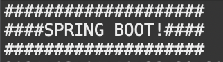

# 스프링 부트 시작하기

스프링 부트는 스프링 프레임워크의 서브 프로젝트이고 Spring과 Boot의 합성어다. 부트는 시스템을 사용 가능한 상태로 만드는 것을 의미한다. 그래서 스프링 부트의 아이콘도 커뮤터의 전원 버튼 모양이다.


## 프레임 워크

프레임 워크는 애플리케이션의 아키텍처에 해당하는 골격코드라고 할 수 있다. 애플리케이션을 개발할 때 가장 중요한것은 애플리케이션의 전체 구조를 결정하는 아키텍처이다. 아키텍처를 직접 개발하는 것이아니라 프레임 워크로 부터 빌려쓰면 개발자는 아키텍처와 결합할 비지니스 로직 개발에만 집중할 수 있다.


#### Presentation

- 스트러츠(Struts)

  스트러cmsms MVC(Model View Controller) 아키텍처를 제공하는 프레임워크다.

- 스프링 MVC

  스트러츠 같은 MVC 아키텍처를 제공하지만 스트러츠처럼 독립적으로 존재하지 않고 스프링 프레임 워크에 포함되어 있다.

##### Business

- 스프링(IoC, AOP)

  스프링 컨테이너에서 동작하는 비지니스 컴포넌트를 개발한다.

#### Persistence

- JPA

  하이버네이트를 비롯한 모든 ORM 프레임 워크의 표준이다.

- MyBatis

  XML 파일에 작성한 SQL을 자바 객체와 매핑해주는 데이터 매퍼 프레임워크다.


## 스프링 부트의 등장

### 스프링 부트의 장점

- 라이브러리 관리 자동화

  기존에도 자바 프로젝트에서는 메이븐이나 그레이들을 이용해서 라이브러리 의존성을 관리했지만, 스프링 부트에서는 스타터를 이용해 특정 기능에 필요한 라이브러리 의존성을 간단히 처리할 수 있다.

  

- 설정 자동화

  스프링 부트는 프로젝트에 추가된 라이브러리를 기반으로 실행에 필요한 환경을 자동으로 설정해준다. 타임리프를 이용하려면 라이브러리를 추가해주기만하면 스프링 부트가 알아서 관련 스프링 설정을 자동으로 처리해준다. 개발자들은 복잡한 타임리프 설정을 하지 않고도 바로 화면 개발에 들어갈 수 있다.

  

- 라이브러리 버전 자동관리

  스프링을 사용하여 개발할때 가장 신경쓰이는 것이 라이브러리와 버전 관리이다. 스프링은 스프링 라이브러리만 사용하여 개발할 수 없고 의존 관계에 있는 서드파티 라이브러리들도 사용한다. 스프링 부트는 해당 버전의 스프링 라이브러리 뿐만아니라 서드파티 라이브러리들도 호환되는 버전으로 알아서 다운로드해준다.

  이 기능 덕분에 라이브러리 버전이 높거나 낮아서 정상적으로 동작하지 않는 상황을 겪을 필요가 없다. 이전 처럼 XML 설정을 이용해서 라이브러리를 매번 설정하는 과정을 줄이고 개발자들이 개발에만 집중할 수 있는 환경을 제공한다.

  

- 테스트 환경과 내장 톰캣

  스프링 부트로 생성한 프로젝트에는 JUnit을 비롯한 테스트 관련 라이브러리들이 기본적으로 포함되어 있다. 따라서 컨트롤러를 비롯한 다양한 계층의 클래스들에대해서 테스트 케이스를 쉽게 작성할 수 있다.

  

- 독립적으로 실행가능한 JAR

  애플리 케이션을 개발하고 테스트를 마쳤으면 애플리케이션을 실제 운영서버에 배포하기 위해서 패키징을 해야하는데, 일반 자바 프로젝트를 JAR 로 간단하게 패키징하면 되지만 웹 프로젝트라면 WAR 파일로 패키징 해야한다. 스프링 부트는 독립적으로 실행 가능한 애플리케이션을 빠르게 개발하는 것을 목표로 하기 때문에 웹 애플리케이션도 WAR가 아닌 JAR 파일로 패키징할 수 있게 해준다.


## 스프링 부트 프로젝트 구조 및 실행


### 스프링 부트 프로젝트 구조

스프링 부트를 생성하면 기본적으로 제공되는 디렉터리나 파일들이 있다. 이 는 정해진 컨벤션을 따르고 있기 때문에 마음대로 변경해서는 안된다. 스프링 부트는 기본적으로 메이븐이 제공하는 프로젝트 구조를 따른다.

세 개으 소스 폴더가 제공되는데 src/main/java 에는 일반적인 자바 파일 소스를 등록하고, src/main/resources에는 자바 소스가 아닌 XML이나 프로퍼티 파일들을 등록한다. JUnit 기반의 테스트 케이스는 src/test/java 에 작성한다.


이 중에서 src/main/resources 가 기존 메이븐 기반 프로젝트와 다르다.


펼처보면 XML 파일들은 없고 웹 애플리케이션과 관련된 static 과 templates 폴더가 있다.

static 폴더는 HTML과 같은 정적인 웹 리소스가 저장되고, templates 폴더에는 타임리프 같은 템플릿 기반의 웹 리소스가 저장된다. 마지막으로 application.properties 파일에는 프로젝트 전체에서 사용할 프로퍼티 정보들을 저장한다.


```xml
<?xml version="1.0" encoding="UTF-8"?>
<project xmlns="http://maven.apache.org/POM/4.0.0" xmlns:xsi="http://www.w3.org/2001/XMLSchema-instance"
	xsi:schemaLocation="http://maven.apache.org/POM/4.0.0 https://maven.apache.org/xsd/maven-4.0.0.xsd">
	<modelVersion>4.0.0</modelVersion>
	<parent>
		<groupId>org.springframework.boot</groupId>
		<artifactId>spring-boot-starter-parent</artifactId>
		<version>2.4.3</version>
		<relativePath/> <!-- lookup parent from repository -->
	</parent>
	<groupId>com.example</groupId>
	<artifactId>demo-app</artifactId>
	<version>0.0.1-SNAPSHOT</version>
	<name>demo-app</name>
	<description>Demo project for Spring Boot</description>
	<properties>
		<java.version>11</java.version>
	</properties>
	<dependencies>
		<dependency>
			<groupId>org.springframework.boot</groupId>
			<artifactId>spring-boot-starter-web</artifactId>
		</dependency>

		<dependency>
			<groupId>org.springframework.boot</groupId>
			<artifactId>spring-boot-starter-test</artifactId>
			<scope>test</scope>
		</dependency>
		
		<dependency>
			<groupId>org.springframework.boot</groupId>
			<artifactId>spring-boot-starter-actuator</artifactId>
		</dependency>
		
	</dependencies>

	<build>
		<plugins>
			<plugin>
				<groupId>org.springframework.boot</groupId>
				<artifactId>spring-boot-maven-plugin</artifactId>
			</plugin>
		</plugins>
	</build>
	
</project>
```

Pom.xml 파일이 기본적으로 제공되는데, 가장 중요한 설정은 의존 관계에 해당하는 \<dependencies\> 설정이다.

- Spring-boot-starter-web

  웹 애플리케이션 개발에 필요한 스프링 MVC 관련 라이브러리

- Spring-boot-starter-test

  JUnit을 비롯한 테스트 관련 라이브러리

특이한 점은 pom.xml 파일에는 의존성 설정이 Web과 Test  두개 밖에 없는데, Maven Dependencies 를 보면 엄청나게 많은 라이브러리가 등록되어 있다.


이는 <parent> 를 이용하여 다른 pom 설정을 상속받은 것이다.

스프링 부트로 만든 애플리케이션을 실행하려면 메인 클래스가 있어야 하는데, 이미 src/main/java 소스 폴더에 '프로젝트 이름Application.java' 형태로 메인 클래스로 작성되어 있다. 

스프링 부트로 만든 애플리케이션은 일반 자바 애플리케이션으로 실행할 수도있고 웹 애플리케이션으로 실행할 수도 있다. 기본적으로 제공되는 상태로 실행하면 웹 어플리케이션으로 실행되고 내장 톰캣이 구동된다. 하지만 약간의 수정을 거치면 내장 톰캣이 구동되지않는다. 

pom.xml 에 'spring-boot-starter-web' 의존성을 'spring-boot-starter' 의존성으로 바꿔주거나, main 함수에서 application.setWebApplicationType(WebApplicationType.NONE); 코드를 추가해주면 일반 자바 애플리케이션으로 동작하게 된다. 또는 외부 프로퍼티를 사용할 수 도있다.

src/main/resource 소스 폴더에서 application.properties 파일을 수정해보자.

```properties
spring.main.web-application-type=none
```

이렇게 해도 톰캣이 동작하지 않는걸 확인할 수 있다. IDE 를 사용하면 자동완성 기능을 제공해준다. 

자바 소스보다 application.properties의 설정이 우선순위가 높다는 것을 주의하자.


## 배너 변경하기

스프링 부트로 만든 애플리케이션을 실행보면 기본 배너가 출력된다.


이 배너를 변경해 보자.


### 배너 제거

일단 배너를 제거하려면 아래 코드와 같이 작성하면된다.

```java
public static void main(String[] args) {
		SpringApplication app = new SpringApplication(DemoAppApplication.class);
//		SpringApplication.run(DemoAppApplication.class, args);
		app.setBannerMode(Banner.Mode.OFF);
		app.run(args);
	}
```


### 배너 변경

이번에는 src/main/resources 폴더 아래에 'banner.txt'파일을 만들어보자.


그리고 

```java

	public static void main(String[] args) {
		SpringApplication app = new SpringApplication(DemoAppApplication.class);
//		SpringApplication.run(DemoAppApplication.class, args);
//		app.setBannerMode(Banner.Mode.OFF);
		app.run(args);
	}
```

배너 모드를 끄는 부분을 주석처리한다.



그럼 이제 스프링 부트 시작시 내가 만든 배너가 출력되는 것을 볼 수 있다.


위와 같이 ${spring-boot.formatted-version} 변수를 추가해주면,


실행시 위와 같이 버전 정보를 출력할 수 있다.


### 배너 파일 위치 변경


위와 같이 banner 폴더를 생성하고 banner.txt를 옮겨보자.

```properties
spring.banner.location=banner/banner.txt
```

그리고, 위 내용을 application.properties 파일에 추가한다. 실행시, 원래대로 작동하는걸 볼 수 있다.

여기서 경로를 src/main/resources 를 기준으로 상대경로로 입력함을 주의하자.


## 톰캣 서버 포트 변경하기

톰캣 서버의 포트를 변경해보자. application.properties 파일에 아래 내용을 추가하자.

```properties
spring.main.web-application-type=servlet
server.port=8000
```

실행시 아래와 같이 포트가 8000번으로 변경됨을 볼 수 있따.


만약 포트번호를 0으로 설정하면 현재 사용되지 않는 포트 번호가 랜덤으로 할당된다.

아래는 0으로 설정후 실행했을때 랜덤한 포트번호인 52737 번으로 서버가 실행된 것을 볼 수 있다.


application.properties에 작성된 server.port=8000 부분에 마우스를 올려놓고 ctrl(혹은 command) 키를 눌러 클릭하면 ServerProperties 클래스로 이동하고, setPort() 메소드가 선택된다. server 라는 접두사로 시작하는 프로퍼티를 설정하는 것이 내부적으로는 ServerProperties 객체의 수정자 메소드 호출로 연결된다.


## 웹 어플리케이션 작성하기

```java
package com.example.demoapp;

import org.springframework.web.bind.annotation.RequestMapping;
import org.springframework.web.bind.annotation.RestController;

@RestController
public class HelloController {
	public HelloController() {
		System.out.println("==> HelloController 생성");
	}
	
	@RequestMapping("/hello")
	public String hello(String name) {
		return "Hello " + name;
	}

}
```

위와 같이 src/main/java 에 클래스를 추가한다. 

@Controller  어노테이션 대신 스프링 4부터 지원하는 @RestController를 사용한다. @RestController를 사용하면 REST 방식의 응답을 처리하는 컨트롤러를 구현할 수 있다. @Controller 를 사용하면 hello 메소드의 리턴 타입으로 문자열을 사용했을 때, 문자열에 해당하는 View를 만들어야 한다. 하지만 @RestController 로 등록하면 리턴되는 문자열이 브라우저에 그대로 출력되기 떄문에 별도로 View 화면을 만들 필요가 없다.

@GetMapping은 기존의 @RequestMapping(value="hello", method=RequestMethod.GET)과 동일한 어노테이션이다.


name에 내이름을 담아서 보내면 위와 같은 결과를 볼 수 있다.


실행 되는 콘솔을 보면 HelloController 객체가 생성되는 것을 볼 수 있다. 요청을 반복적으로 보내도 HelloController 는 처음 실행시에만 생성되는 것을 확인할 수 있다.


### 자동 컴포넌트 스캔

스프링 문법에 따르면 @RestController를 설정했다 하더라도, XML 설정 파일에 \<context:component-scan\> 을 설정하지 않으면 컨테이너가 컨트롤러를 빈으로 등록하지 않는다. 하지만 스프링 부트에서는 컴포넌트 스캔이 자동으로 처리된다. 

비밀은 @SpringBootApllication 어노테이션에 있다.


@SpringBootApplication이 포함하는 어노테이션은 매우 다양한데, 그중 @ComponentScan어노테이션은 메인 클래스가 속해 있는 패키지를 베이스 패키지로 하여 빈 등록을 처리한다. 즉, XML 설정 파일에 \<context:component-scan base-package="해당 패키지 이름"\> 로 설정한 것과 동일하게 동작한다. 루트 패키지가 아닌 다른 패키지에 클래스를 작성하면 스프링 컨테이너는 해당 클래스를 빈으로 등록하지 않게 됨으로 주의해야한다.

만약 메인 패키지가 아닌 다른 패키지를 등록하고 싶다면 메인 클래스에 @ComponentScan(basePackages={"메인 패키지", "다른 패키지"}) 어노테이션을 붙여아한다.


### REST 컨트롤러 사용하기

@RestController는 JSP 같은 뷰를 별도로 만들지 않는 대신에 컨트롤러 메소드가 리턴한 데이터 자체를 클라이언트로 전달한다. 클라이언트로 전달되는 데이터는 대부분 문자열이거나 VO(Value Object)나 컬렉션 형태의 자바객체인데 자바 객체가 전달되는 경우에는 자동으로 JSON으로 변환하여 처리하게 된다.


### 스프링 DevTools 사용하기

새로운 변경사항이 있으면 반드시 실행중인 애플리케이션을 중지한 뒤 애플리케이션을 재실행 해야한다. 그래야 수정사항이 반영되기 때문이다. 매번 애플리케이션을 재실행하는 것이 귀찮으면 스프링 부트가 제공하는 DevTools 기능을 이용하면된다.

pom.xml 을열고 의존성을 추가해보자.


Dependency 에서 자동완성 기능을 누르고 Add Starters 메뉴를 선택한다.


Spring Boot DevTools 를 추가해주면 pom.xml에 아래와 같은 내용이 추가된 것을 볼 수 있다.


이제 내용을 수정하면 자동으로 적용되는 것을 볼 수 있다.


## 롬복 라이브러리 사용하기

웹 애플리케이션에서 사용하는 VO(Value Object) 클래스는 일반적으로 테이블의 칼럼 이름과 동일한 private 멤버 변수를 가진다. 그리고 그에 접근하기 위한 public Setter,Getter 메서드가 필요하고, toString() 메소드를 재정의 해줘야한다. 이런 메소드들은 이클립스의 단축키 Alt + Shift + S 를 이용하여 쉽게 생성할 수 있다.

하지만 소스가 너무 지저분해지고 모든 VO 클래스와 JPA에 사용할 도메인 클래스에 이런 메소드를 반복적으로 작성하는 것은 귀찮은 일이다. 이런 문제를 간단하게 해결할 수 있는 것이 롬복(Loombok)이다. 롬복을 사용하면 자바 파일을 컴파일할때 자동으로 생성자와 Getter 및 Setter, toString() 메서드를 자동으로 추가해준다.


```java
package com.example.demoapp;

import java.util.Date;

import lombok.Getter;

@Getter
public class TestVO {
	private int seq;
	private String title;
	private Date createDate = new Date();
}
```

Lombok 을 설치하고 나서, 위와 같은 TestVO 클래스를 만들고, @Getter 어노테이션을 만들어준 다음 프로젝 익스플로러를 열어보면 아래와 같이 Getter 메서드가 추가된 것을 볼 수 있다.


이 외에도 @Setter, @ToString, @Data 등의 어노테이션도 사용할 수 있다. @Data의 경우 @Getter,@Setter를 비롯한 모든 어노테이션을 포함하기때문에 매우 유용하게 사용할 수 있다.