# 의존성 관리와 자동 설정

## 스프링 부트의 의존성 관리

스프링 부트를 구성하는 핵심 요소는 Starter, AutoConfiguration, Actuator 이다.

- Starter: 스프링이 제공하는 특정 모듈을 사용할 수 있도록 관련된 라이브러리 의존성을 해결한다.
- AutoConfiguration: 스타터를 통해 추가한 모듈을 사용할 수 있도록 관련된 빈 설정을 자동으로 처리해준다.
- Actuator: 스프링 부트로 개발된 시스템을 모니터링할 수 있는 다양한 기능을 제공한다.


프로젝트를 생성하고, Web,Lombok, DevTool을 추가한다.


여기서 만약 jpa 를 추가하려고 한다면 메이븐 레포지터리에 들어가서 jpa 구현체를 검색하고 dependency를 복사하여 pom.xml 에  추가할 수 있다. 문제는 프로젝트에 필요 의존성만 추가했다고 스프링과 jpa 연동을 바로 처리할 수 는 없다는 것이다. 스프링과 jpa 를 추가하기 위해서는 다른 라이브러리들이 추가로 필요하다. 어떤 라이브러리가 필요하고 어떤 버전을 사용해야하는지 미리 알기는 쉽지 않다.

이런 문제를 효과적으로 해결하기위해서 제공된 것이 스프링 부트의 스타터이다. 스타터는 필요한 라이브러리들을 관련된 것끼리 묶어서 패키지처럼 제공한다. 따라서 프로젝트에 사용하고 싶은 모듈이 있으면 그 모듈에 해당하는 스타터만 의존성으로 추가하면 된다. 그러면 관련된 라이브러리 의존성 문제가 자동으로 해결된다. 스프링 부트는 다양한 스타터들을 제공하고 "spring-boot-starter-모듈명" 형태의 이름이 바로 그것이다.


스타터는 최소한의 설정만으로 수많은 라이브러리를 자동으로 관리한다. 스타터에 있는 POM 파일의 상속 구조덕분이다. Pom.xml 에 있는 Parent를 눌러 이동할 수 있다. 


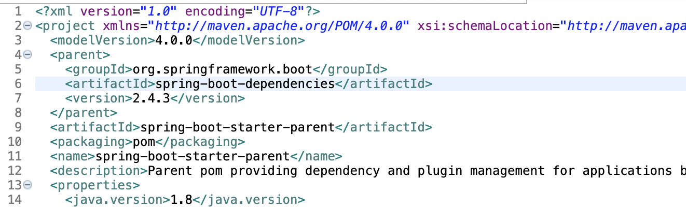

그럼 spring-boot-starter-parent-version-RELEASE.pom 으로 이동하게 된다. 이 파일에는 버전정보보다는 플러그인 설정만 있다. 다시 이 파일의 부모로 이동해보면,

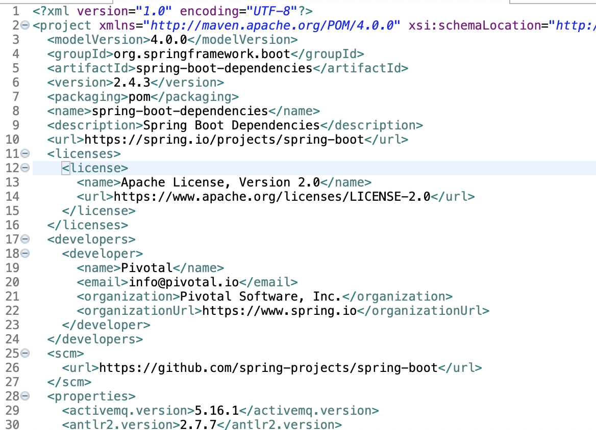

Spring-boot-dependencies-version.RELEASE.pom 파일이 나온다. 여기에 의존성 정보와 버전 정보들이 들어있다.

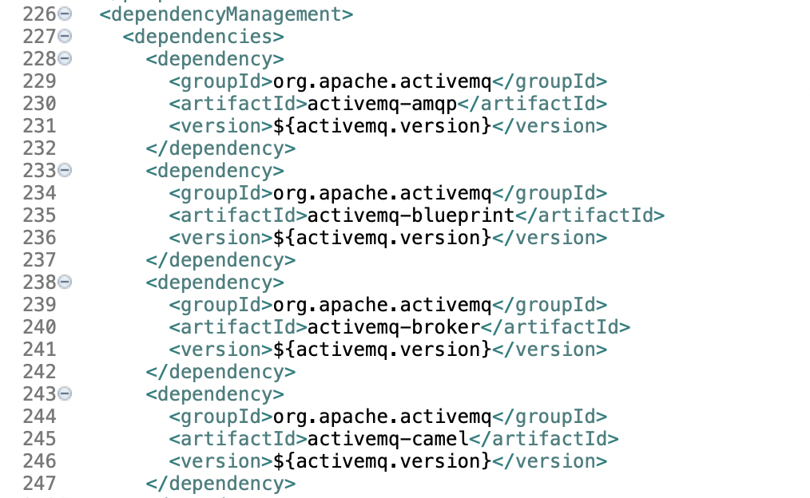

이런 형태로 상속구조를 확인할 수 있었다.


## 의존성 재정의하기

### 스타터 재정의하기

부모로부터 상속된 의존성은 자식 프로젝트에서 재정의할 수 있다. 부모로부터 받은 프로퍼티를 사용하지않고 재정의하면 우선순위가 더 높기 때문에 부모의 설정이 적용되지 않고 재정의한 설정이 적용된다.


잠시 뒤, Maven Dependencies 를 확인해보면 바뀐게 보인다. 스타터의 버전을 변경하면 스타터가 관리하는 수많은 의존성이 호환 가능한 버전으로 자동으로 변경된다고한다.

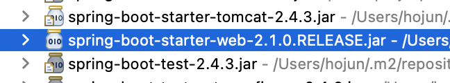


### 프로퍼티 재정의하기

만약 spring-boot-starter-web이 제공하는 라이브러리들 중 스프링 프레임워크 버전만 변경하고 싶은 경우에는 부모로부터 상속받은 프로퍼티를 재정의 하면된다. 

```properties
<properties>
		<java.version>11</java.version>
		<spring.version>5.1.4.RELEASE</spring.version>
	</properties>
```

Maven Dependencies 를 확인해 보면 스프링의 버전이 바뀐다고 하는데, 나는 왜 안되는지 모르겠따.


## 자동설정 이해하기

### 자동 설정

스프링 부트로 만든 프로젝트에는 애플리케이션 실행을 위한 메인 클래스가 기본적으로 제공된다. 스프링 MVC를 이용하여 웹 애플리케이션을 개발하려면 기본적으로 여러가지 설정이 필요했다. 하지만 지금까진 복잡한 설정 없이도 웹 애플리케이션을 만들고 실행할 수 있었는데 이는 스프링 부트가 자동설정 기능을 제공하고 수 많은 빈들을 자동으로 등록하고 동작했기 때문이다. 그리고 그 모든 것은 @SpringBootApplication 어노테이션 덕분에 가능하다.

@SpringBootApplication은 @EnableAutoConfiguration 어노테이션을 가지고 있다.

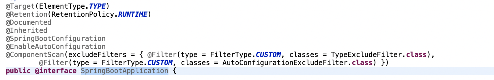

가장 중요한 것은 @SpringBootConfiguration, @EnableAutoConfiguration, @ComponentScan 이 세개 이다.

@SpringBootApplication 을 삭제하고 위 세개의 어노테이션으로 대체하면 실행결과가 같다.

@SpringBootConfiguration은 @Configuration과 동일하다. 

@ComponentScan은 @Configuration, @Repository, @Service, @RestController 등이 붙은 객체를 메모리에 올리는 역할을 한다. @TypeExcludeFilter와 AutoConfigurationExcludeFilter를 제외하고 나머지 객체들을 스캔해서 초기화 하도록 설정한 것이다. 이렇게 하면 몇개의 필터를 제외하고 Chapter02Application 클래스가 있는 패키지를 기준으로 우리가 만든 클래스들을 컴포넌트 스캔하여 빈으로 등록한다.


@EnableAutoConfiguration은 자동 설정과 관련된 어노테이션이다. 스프링 부트는 컨테이너를 구동할때 두단계로 나누어 객체들을 초기화한다. 애플리케이션을 운영할때 두 종류의 빈들이 필요하기 때문이다. 


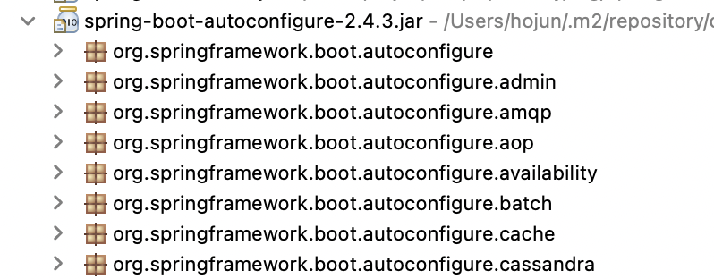

Spring-boot-autoconfiguration 파일의 META-INF/spring.factories 파일을 열어보면

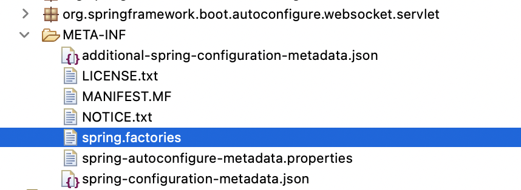


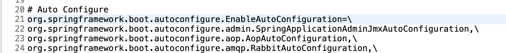

수많은 스프링 빈 설정 파일들을 볼 수 있다.

이중에, WebMvcAutoConfiguration을 열어보자.

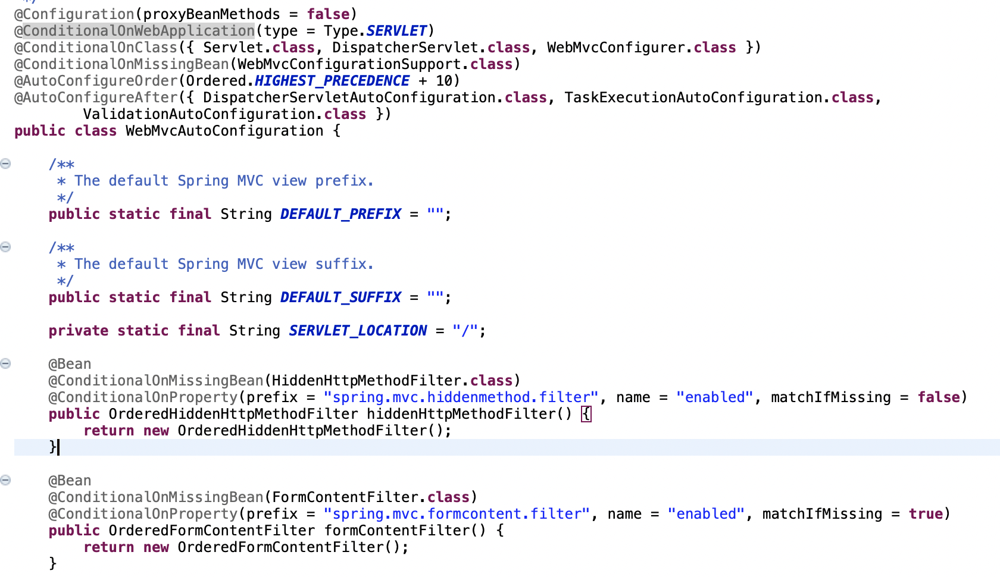

@Configuration 어노테이션은 이 클래스가 스프링 빈 설정 클래스임을 나타낸다. @ComponentScan이 처리될 때 이 클래스에 @Bean으로 설정된 모든 빈들이 초기화 된다.

@ConditionalOnWebApplication은 웹 애플리케이션 타입이 어떻게 설정되어있는지를 확인하는 어노테이션이다. 서블릿 타입으로 설정되어 있을때 이 자동설정 클래스 설정을 적용하라는 의미이다.

@ConditionalOnClass 는 특정 클래스가 클래스 패스에 존재할때 현재 설정 클래스를 적용하라는 의미이다.

@ConditionalOnMissingBean은 특정 클래스 객체가 메모리에 없을 때, 현재 설정 클래스를 적용하라는 의미이다.

@AutoConfigureOrder 는 자동 설정 클래스들의 우선순위를 지정할 때 사용한다.

Ordered.HIGHEST_PRECEDENCE + 10 설정은 현재 자동 설정 클래스의 우선 순위를 가장 높은 우선순위보다 10 단계 더 높게 설정한 것이다.

마지막으로 @AutoConfigureAfter는 현재 자동설정 클래스가 다른 자동 설정 클래스 다음에 적용되도록 지정할때 사용한다.


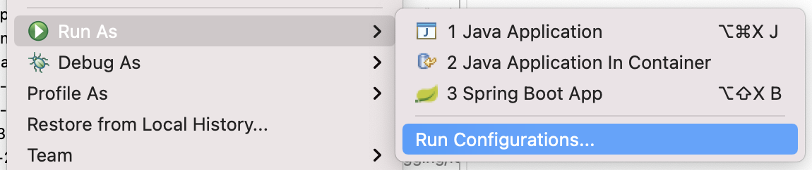

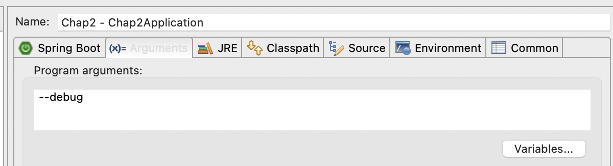

위와 같이 메인 클래스의 Run Configuration을 바꿔주면 실행할 때 어떤 설정빈들이 자동으로 메모리에 올라가서 초기화 되었는지 로그를 통해 직접 확인할 수 있다.


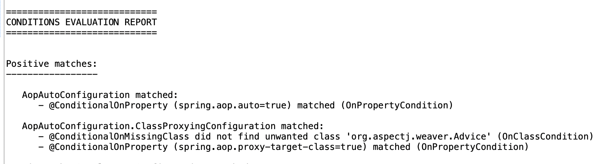


## 사용자 정의 스타터

스타터는 프로젝트에 필요한 의존성을 편리하게 관리하기 위함이고, 자동 설정은 애플리케이션 웅용에 필요한 빈들을 초기화 하는 기능이다.

스프링 부트는 범용적인 프로젝트 개발을 목표로 설계되어 있어 특정 비지니스에 특화되어 있지 않아 있다. 따라서 특정 도메인이나 비지니스 개발에 최적화된 스타터나 자동완성을 만들어서 사용하면 좋다.

사용자가 직접 작성한 클래스들을 이용해서 스타터를 만들고 사용자가 만든 스타터를 스프링 부트의 스타터처럼 사용해보자.

Maven Project를 하나 만든다.


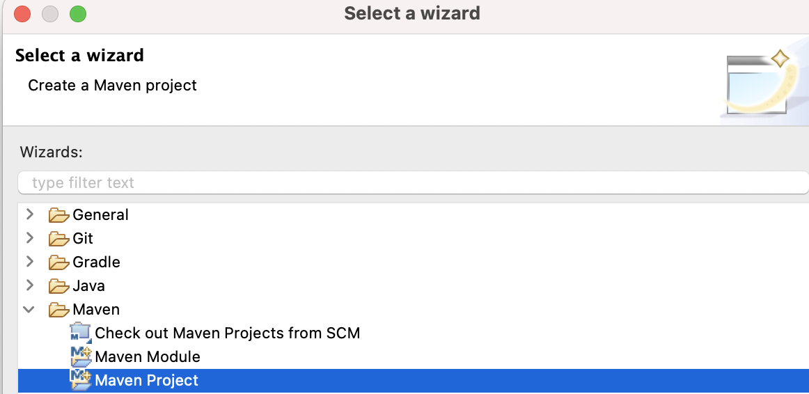

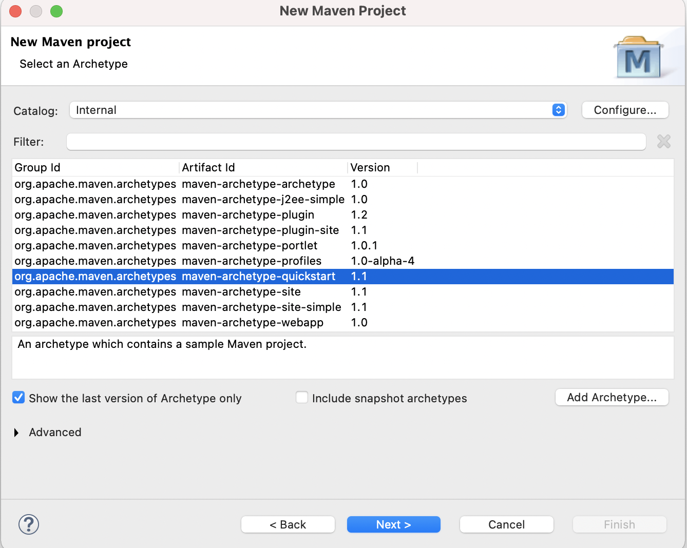

그리고 pom.xml을 열어 다음과 같이 수정한다.


```xml
<project xmlns="http://maven.apache.org/POM/4.0.0" xmlns:xsi="http://www.w3.org/2001/XMLSchema-instance"
  xsi:schemaLocation="http://maven.apache.org/POM/4.0.0 http://maven.apache.org/xsd/maven-4.0.0.xsd">
  <modelVersion>4.0.0</modelVersion>

  <groupId>com.hojun</groupId>
  <artifactId>hojun-spring-boot-starter</artifactId>
  <version>0.0.1-SNAPSHOT</version>
  <packaging>jar</packaging>

  <name>hojun-spring-boot-starter</name>
  <url>http://maven.apache.org</url>

  <properties>
    <project.build.sourceEncoding>UTF-8</project.build.sourceEncoding>
  </properties>

  <dependencies>
    <dependency>
      <groupId>junit</groupId>
      <artifactId>junit</artifactId>
      <version>3.8.1</version>
      <scope>test</scope>
    </dependency>
    
    <dependency>
    	<groupId>org.springframework.boot</groupId>
    	<artifactId>spring-boot-autoconfigure</artifactId>
    	<version>2.1.5.RELEASE</version>
    </dependency>
  </dependencies>
</project>
```

메이븐 프로젝트를 자동설징 기능으로 구현하기 위해서 스프링 부트가 제공하는 자동 설정 라이브러리를 추가한 것이다.

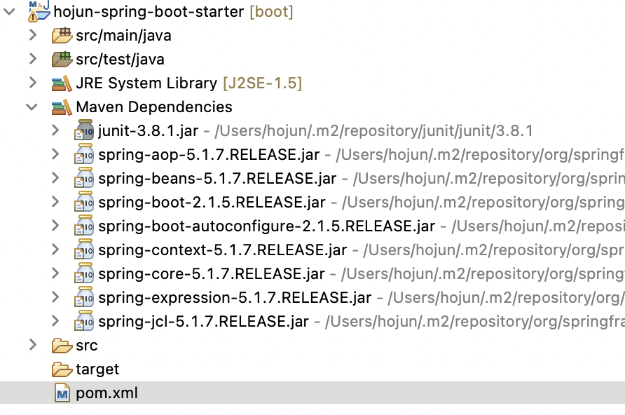

Maven 의존성을 보면 라이브러리가 추가된 것을 볼 수 있다. 만약 앞으로 새로운 라이브러리들을 계속 추가하면서 추가되는 라이브러리들의 버전을 일괄적으로 관리하고 싶으면 pom.xml 파일에 \<dependencyManagement\> 설정을 추가한다.


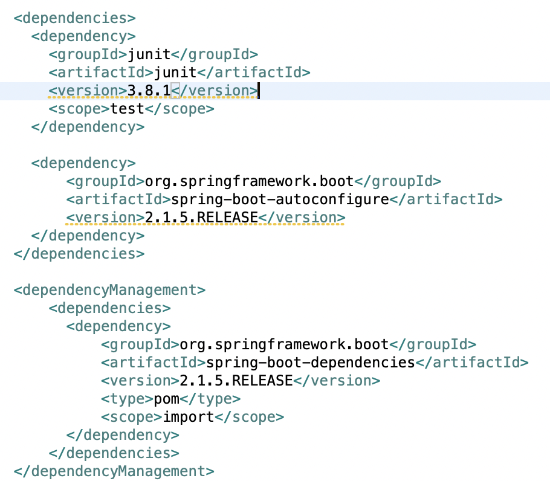

dependencyManagement를 추가하자 버전 정보에 경고가 뜬다.  dependencyManagement를 추가하면 부모 pom 파일에 정의된 설정 정보를 상속 받을 수 있다.  부모에 있는 버전 정보를 사용하게 되는데, 여기서도 버전을 정의하면 겹치는게 있다고 경고가 뜨는 것이다. 여기서 버전 정보를 삭제하면 부모에 정의된 버전 정보를 사용하게된다.


```java
package com.hojun.hojun_spring_boot_starter;

import java.sql.Connection;
import java.sql.DriverManager;

import lombok.Setter;

@Setter
public class JDBCConnectionManager {
	private String driverClass;
	private String url;
	private String username;
	private String password;
	
	public Connection getConnection() {
		try {
			Class.forName(driverClass);
			return DriverManager.getConnection(url, username, password);
		} catch(Exception e) {
			e.printStackTrace();
		}
		return null;
	}
	
	@Override
	public String toString() {
		return "JDBCConnectionManager [dirverClass=" + driverClass + ", url=" + url + " , username=" + username
				+ ", password=" + password;
	}
}
```

위와 같이 JDBC 연결을 만들어주는 클래스를 작성하고,


```java
package com.hojun.hojun_spring_boot_starter;

import org.springframework.context.annotation.Bean;
import org.springframework.context.annotation.Configuration;

@Configuration
public class BoardAutoConfiguration {
	
	@Bean
	public JDBCConnectionManager getJdbcConnectionManager() {
		JDBCConnectionManager manager = new JDBCConnectionManager();
		manager.setDriverClass("oracle.jdbc.driver.OracleDriver");
		manager.setUrl("jdbc:oracle:thin:@localhost:1521:xe");
		manager.setUsername("hojun");
		manager.setPassword("hojun password");
		return manager;
	}
}
```

환경 설정을 위한 클래스도 하나 만들어준다.

그리고 src/main/resources 폴더에 META-INF 폴더를 만들어주고, spring.factories 파일을 생성하고 아래와 같이 환경 설정 클래스를 추가해준다.

```
org.springframework.boot.autoconfigure.EnableAutoConfiguration=\
com.hojun.hojun_spring_boot_starter.BoardAutoConfiguration
```

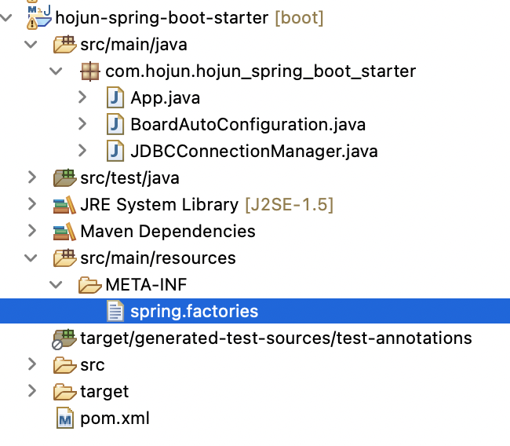

나는 위와같은 구조로 만들었다. 이제 프로젝트에서 Maven install을 하면 target 폴더 아래에 JAR 파일을 생성하고 다른 프로젝트에서 이 프로젝트를 사용할 수 있도록 메이븐 로컬 리포지터리에도 등록해준다.

로컬 메이븐 리포지터리의 경로는 아래와 같다.

```bash
Windows: C:\Users\<User_Name>\.m2
Linux: /home/<User_Name>/.m2
Mac: /Users/<user_name>/.m2
```

이제 pom.xml 에 있는 groupId, artifactId, version 을 복사해서 다른 프로젝트로 가져간다.

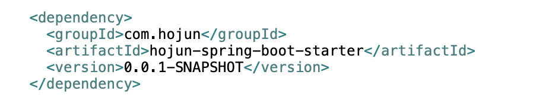

그리고 Maven dependencies 를 보면 아래 처럼 직접 만든 스타터가 등록되어 있는것을 확인할 수 있다.


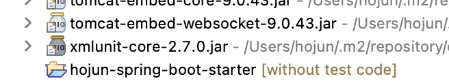

이제 이 새로운 프로젝트에 아래와 같은 클래스를 추가한다.

```java
package com.hojun.chap2;

import org.springframework.beans.factory.annotation.Autowired;
import org.springframework.boot.ApplicationArguments;
import org.springframework.boot.ApplicationRunner;
import org.springframework.stereotype.Service;

import com.hojun.hojun_spring_boot_starter.JDBCConnectionManager;

@Service
public class JDBCConnectionManagerRunner implements ApplicationRunner{
	@Autowired
	private JDBCConnectionManager connectionManager;
	
	@Override
	public void run(ApplicationArguments args) throws Exception {
		// TODO Auto-generated method stub
		System.out.println("커넥션 매니저 : " + connectionManager);
	}
}
```

위 클래스는 ApplicationRunner 를 구현하였으므로, 애플리케이션 실행시 객체가 실행되자마자 run 메서드가 실행되게 된다.

그럼 아래와 같이 DB 환경 설정 객체를 다른 스타터로 부터 가져와 빈으로 등록한 모습을 확인할 수 있다.

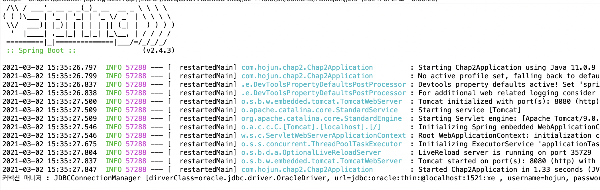


## 자동설정 재정의 하기

다른 프로젝트에서 자동설정으로 등록된 JDBCConnectionManager를 사용해서 다른 데이터베이스를 사용하고싶으면 어떻게할까?

```java
package com.hojun.chap2;

import org.springframework.context.annotation.Bean;
import org.springframework.context.annotation.Configuration;

import com.hojun.hojun_spring_boot_starter.JDBCConnectionManager;

@Configuration
public class BoardAutoConfiguration {
	
	@Bean
	public JDBCConnectionManager getJdbcConnectionManager() {
		JDBCConnectionManager manager = new JDBCConnectionManager();
		manager.setDriverClass("org.h2.Driver");
		manager.setUrl("jdbc:h2:tcp://localhost/~/test");
		manager.setUsername("hojun2");
		manager.setPassword("hojun2 password");
		return manager;
	}
}

```

위 처럼 새롭게 설정 클래스를 만들어서 등록해주면 아래와 같은 애러를 만날 수 있다.

```
The bean 'getJdbcConnectionManager', defined in class path resource [com/hojun/hojun_spring_boot_starter/BoardAutoConfiguration.class], could not be registered. A bean with that name has already been defined in class path resource [com/hojun/chap2/BoardAutoConfiguration.class] and overriding is disabled.

Action:

Consider renaming one of the beans or enabling overriding by setting spring.main.allow-bean-definition-overriding=true
```

같은 종류의 클래스를 등록하려니까 에러가 난 것이다.  application.properties 에 

'spring.main.allow-bean-definition-overriding=true' 을 추가해주자. 그러면 실행이 된다. 결과를 보면 아래와 같은데

```
커넥션 매니저 : JDBCConnectionManager [dirverClass=oracle.jdbc.driver.OracleDriver, url=jdbc:oracle:thin:@localhost:1521:xe , username=hojun, password=hojun password
```

이는 이 프로젝트에서 추가된 빈이 아닌, 다른 스타터에서 가져온 빈이다. 이 문제를 해결하기 위해서 @Conditional 어노테이션을 사용해보자.

만들었던 스타터 프로젝트에 추가해야한다. 

```java
package com.hojun.hojun_spring_boot_starter;

import org.springframework.boot.autoconfigure.condition.ConditionalOnMissingBean;
import org.springframework.context.annotation.Bean;
import org.springframework.context.annotation.Configuration;

@Configuration
public class BoardAutoConfiguration {
	
	@Bean
	@ConditionalOnMissingBean
	public JDBCConnectionManager getJdbcConnectionManager() {
		JDBCConnectionManager manager = new JDBCConnectionManager();
		manager.setDriverClass("oracle.jdbc.driver.OracleDriver");
		manager.setUrl("jdbc:oracle:thin:@localhost:1521:xe");
		manager.setUsername("hojun");
		manager.setPassword("hojun password");
		return manager;
	}
}
```

@ConditionalOnMissingBean 어노테이션을 추가하면 등록하려는 빈이 메모리에 없는 경우에만 현재의 빈 등록 처리하게 만든다. 

사용자가 현재 프로젝트에 정의한 빈이 먼저 등록되고, 스타터에서 제공하는 빈 등록이 이뤄질때 이미 등록된 빈이 있기 때문에 우리가 원하는 빈만 등록되는 것이다.


다시 실행하면 아래와 같이 사용자가 다시 정의한 빈으로 실행되는 것을 볼 수 있다.

```
커넥션 매니저 : JDBCConnectionManager [dirverClass=org.h2.Driver, url=jdbc:h2:tcp://localhost/~/test , username=hojun2, password=hojun2 password
```


스프링 컨테이너가 생성한 빈의 멤버 변수값이 자주 변경될때는 자바 소스를 수정하기보다는 변경되는 정보만 프로퍼티로 등록하고 이 프로퍼티 정보를 이용해서 빈을 생성하면 편리하다. 기존 스프링의 \<context:place-holder\> 라는 태그를 이용해서 외부 프로퍼티를 이용했듯이 말이다.


스타터 프로젝트에서 다음과 같이 'JDBCConnectionManagerProperties' 클래스를 생성한다.

```java
package com.hojun.hojun_spring_boot_starter;

import org.springframework.boot.context.properties.ConfigurationProperties;

import lombok.Data;

@ConfigurationProperties(prefix="board.jdbc")
@Data
public class JDBCConnectionManagerProperties {
	private String driverClass;
	private String url;
	private String username;
	private String password;
}
```

그리고 외부 프로젝트의 src/main/resources 폴더에 application.properties 파일에 아래와 같이 추가한다.

```properties
board.jdbc.driverClass=oracle.jdbc.driver.OracleDriver
board.jdbc.url=jdbc:oracle:thin:@localhost:1521:xe
board.jdbc.username=hojun
board.jdbc.password=hojun password
```

그리고 pom.xml 에 의존성으로 프로퍼티를 처리해주는 'spring-boot-configuration-processor'을 추가해준다.

```xml
<dependency>
		<groupId>org.springframework.boot</groupId>
		<artifactId>spring-boot-configuration-processor</artifactId>
		<optional>true</optional>
</dependency>
```


마지막으로 환경 설정 빈을 프로퍼티를 사용하도록 변경해준다.

```java
package com.hojun.hojun_spring_boot_starter;

import org.springframework.beans.factory.annotation.Autowired;
import org.springframework.boot.autoconfigure.condition.ConditionalOnMissingBean;
import org.springframework.boot.context.properties.EnableConfigurationProperties;
import org.springframework.context.annotation.Bean;
import org.springframework.context.annotation.Configuration;

@Configuration
@EnableConfigurationProperties(JDBCConnectionManagerProperties.class)
public class BoardAutoConfiguration {
	@Autowired
	private JDBCConnectionManagerProperties properties;
	
	@Bean
	@ConditionalOnMissingBean
	public JDBCConnectionManager getJdbcConnectionManager() {
		JDBCConnectionManager manager = new JDBCConnectionManager();
		manager.setDriverClass(properties.getDriverClass());
		manager.setUrl(properties.getUrl());
		manager.setUsername(properties.getUsername());
		manager.setPassword(properties.getPassword());
		return manager;
	}
}

```

프로퍼티는 @Autowired 로 주입받아 사용한고, 클래스에 @EnableConfigurationProperties(사용프로퍼티클래스) 어노테이션을 추가해야한다.

 이제 Maven Install 실행후 다른 프로젝트로 이동해본다.'


실행하면 이제 application.properties 에 있는 값으로 초기화된 빈을 볼 수 있다.

```
커넥션 매니저 : JDBCConnectionManager [dirverClass=oracle.jdbc.driver.OracleDriver, url=jdbc:oracle:thin:@localhost:1521:xe , username=hojun, password=hojun password
```

