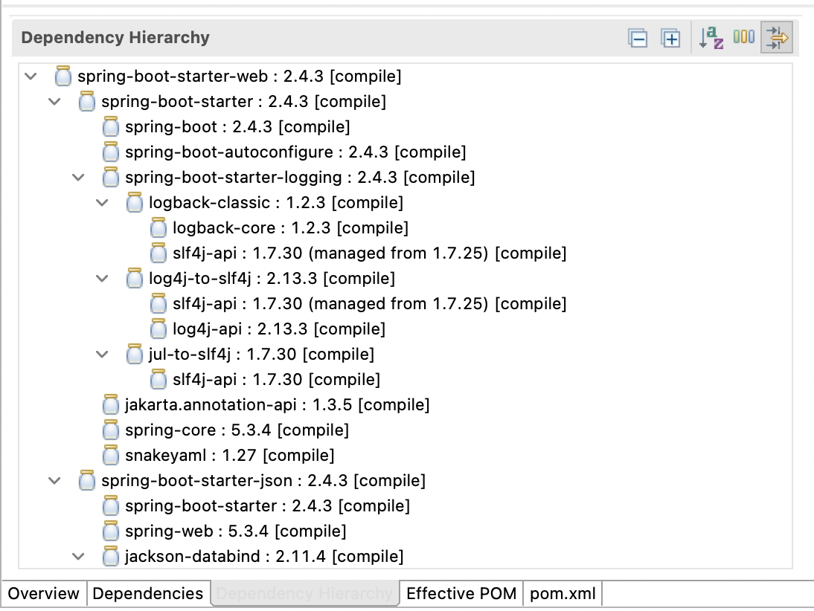
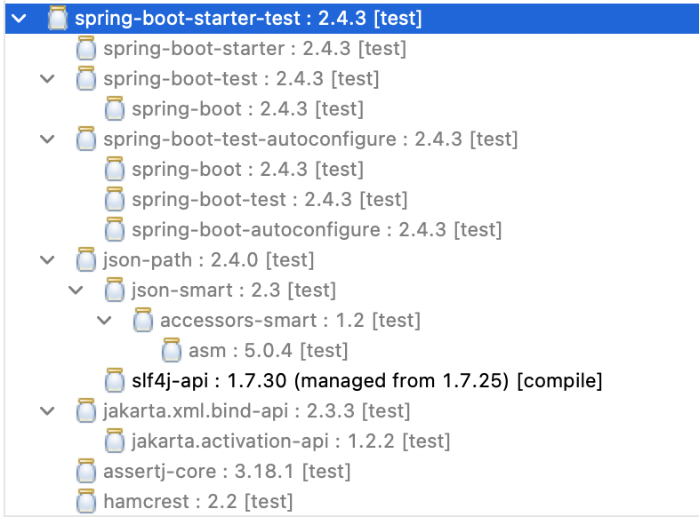
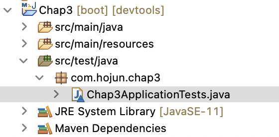
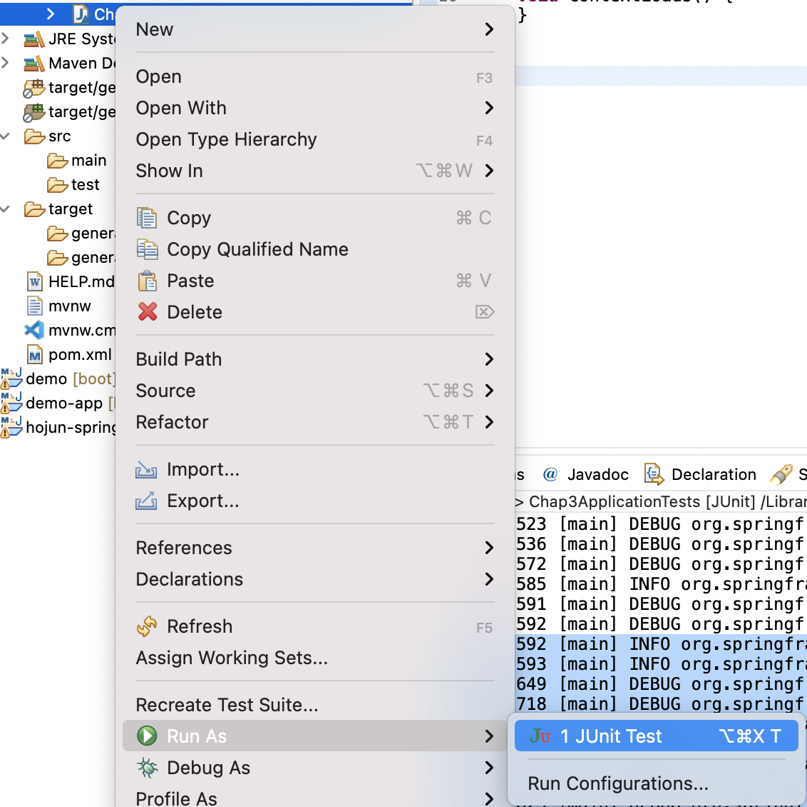
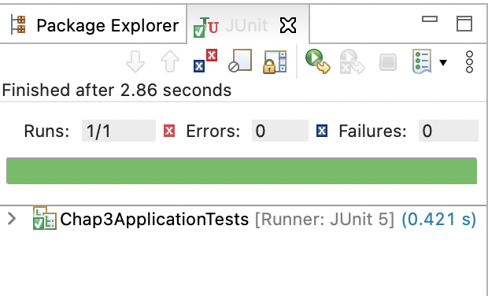
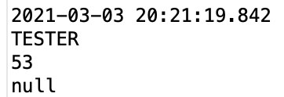
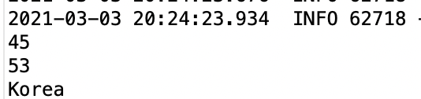
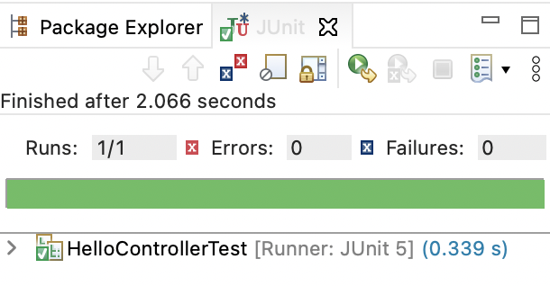

# 테스트와 로깅, 빌드

## 기본 셋팅

새 프로젝트를 만들고 DevTools, Lombok, Web을 추가하자.

```xml
<?xml version="1.0" encoding="UTF-8"?>
<project xmlns="http://maven.apache.org/POM/4.0.0" xmlns:xsi="http://www.w3.org/2001/XMLSchema-instance"
	xsi:schemaLocation="http://maven.apache.org/POM/4.0.0 https://maven.apache.org/xsd/maven-4.0.0.xsd">
	<modelVersion>4.0.0</modelVersion>
	<parent>
		<groupId>org.springframework.boot</groupId>
		<artifactId>spring-boot-starter-parent</artifactId>
		<version>2.4.3</version>
		<relativePath/> <!-- lookup parent from repository -->
	</parent>
	<groupId>com.hojun</groupId>
	<artifactId>Chap3</artifactId>
	<version>0.0.1-SNAPSHOT</version>
	<name>Chap3</name>
	<description>Demo project for Spring Boot</description>
	<properties>
		<java.version>11</java.version>
	</properties>
	<dependencies>
		<dependency>
			<groupId>org.springframework.boot</groupId>
			<artifactId>spring-boot-starter-web</artifactId>
		</dependency>

		<dependency>
			<groupId>org.springframework.boot</groupId>
			<artifactId>spring-boot-devtools</artifactId>
			<scope>runtime</scope>
			<optional>true</optional>
		</dependency>
		<dependency>
			<groupId>org.projectlombok</groupId>
			<artifactId>lombok</artifactId>
			<optional>true</optional>
		</dependency>
		<dependency>
			<groupId>org.springframework.boot</groupId>
			<artifactId>spring-boot-starter-test</artifactId>
			<scope>test</scope>
		</dependency>
	</dependencies>

	<build>
		<plugins>
			<plugin>
				<groupId>org.springframework.boot</groupId>
				<artifactId>spring-boot-maven-plugin</artifactId>
				<configuration>
					<excludes>
						<exclude>
							<groupId>org.projectlombok</groupId>
							<artifactId>lombok</artifactId>
						</exclude>
					</excludes>
				</configuration>
			</plugin>
		</plugins>
	</build>

</project>
```

위와 같은 pom.xml 을 확인할 수 있게된다.




dependency hierarchy도 볼 수 있다.


그중에서 'spring-boot-starter-test' 스타터의 계층구조를 보면



많은 라이브러리들이 포함되어 있는것을 볼 수 있다.


## 파일구조

스프링 부트는 프로젝트를 생성할 때, src/test/java 소스폴더에 간단한 테스트 케이스를 제공한다.




```java
package com.hojun.chap3;

import org.junit.jupiter.api.Test;
import org.springframework.boot.test.context.SpringBootTest;

@SpringBootTest
class Chap3ApplicationTests {

	@Test
	void contextLoads() {
	}

}
```

@SpringBootTest 어노테이션은 메인 클래스의 @SpringBootApplication 과 비슷한 어노테이션이라고 생각하면 된다.

테스트 케이스가 실행될 때 테스트에 필요한 모든 설정과 빈들을 자동으로 초기화 하는 역할을 수행한다.


## 테스트 실행



위와 같은 방법으로 테스트를 실행시킬 수 있다.



테스트를 실행하면 JUnit 창이 나오고 테스트 결과를 확인할 수 있다.


## 테스트 클래스 이해하기

@SpringBootTest는 복잡한 테스트 설정들을 자동으로 처리하고, 테스트 관련 객체들도 메모리에 올려준다. 그리고 여러 속성을 가질 수 있는데 각 속성의 의미는 다음과 같다.

- properties: 테스트가 실행되기 전에 테스트에 사용할 프로퍼티들을 'key=value' 형태로 추가하거나 application.properties 파일에 설정된 프로퍼티를 재정의 한다. 
- classes: 테스트할 클래스들을 등록한다. 만약 classes 속성을 생략하면 애플리케이션에 정의된 모든 빈을 생성한다.
- webEnvironment: 애플리케이션이 실행될 때, 웹과 관련된 환경을 설정할 수 있다.


이제 src/main/java 에 아래와 같은 클래스를 만들어보자.

```java
package com.hojun.chap3;

import org.springframework.web.bind.annotation.RequestMapping;
import org.springframework.web.bind.annotation.RestController;

@RestController
public class HelloController {
	public HelloController() {
		System.out.println("==> HelloController 생성");
	}
	
	@RequestMapping("/hello")
	public String hello(String name) {
		return "Hello " + name + "!!";
	}

}
```

그리고  테스트를 실행해보면 HelloController 빈이 만들어지면서 로그를 출력함을 알 수 있다.


이렇게 @SpringBootTest 어노테이션을 달면 모든 빈이 생성되는듯 하다.


## 외부 프로퍼티 사용하기

테스트 케이스를 작성하다보면 여러 테스트에서 공통으로 사용하는 데이터들이 있는데 이런 데이터를 외부에 프로퍼티로 등록하면 테스트 케이스를 재사용하거나 변경하기 쉽다.

src/main/resource 에 있는 application.properties 파일에 아래와 같은 프로퍼티를 추가하자.

```properties
author.name=TESTER
author.age=53
```

그리고 프로퍼티를 읽어들이는 테스트를 작성하고 실행한다.

```java
package com.hojun.chap3;

import static org.junit.jupiter.api.Assertions.*;

import org.junit.jupiter.api.Test;
import org.springframework.beans.factory.annotation.Autowired;
import org.springframework.boot.test.context.SpringBootTest;
import org.springframework.core.env.Environment;

@SpringBootTest
class PropertiesTest {
	@Autowired
	Environment enviroment;

	@Test
	void test() {
		System.out.println(enviroment.getProperty("author.name"));
		System.out.println(enviroment.getProperty("author.age"));
		System.out.println(enviroment.getProperty("author.nation"));
	}

}
```



실행 결과 프로퍼티 파일에 있는 값들을 키 값으로 읽어오는 것을 확인할 수 있었다. 단, 지정되지 않은 키 값은 null 값을 가진다.

 @SpringBootTest 어노테이션의 properties 속성을 주어 테스트 동안의 프로퍼티 값을 변경할 수 있다. 

```java
package com.hojun.chap3;

import static org.junit.jupiter.api.Assertions.*;

import org.junit.jupiter.api.Test;
import org.springframework.beans.factory.annotation.Autowired;
import org.springframework.boot.test.context.SpringBootTest;
import org.springframework.core.env.Environment;

@SpringBootTest(properties = 
{ 		
		"author.name=Gurum",
		"author.name=45",
		"author.nation=Korea"
})
class PropertiesTest {
	@Autowired
	Environment enviroment;

	@Test
	void test() {
		System.out.println(enviroment.getProperty("author.name"));
		System.out.println(enviroment.getProperty("author.age"));
		System.out.println(enviroment.getProperty("author.nation"));
	}

}
```



프로퍼티 값이 바뀐채 테스트가 실행되는 것을 확인할 수 있다.

그리고 classes 속성을 주게 되면 지정된 클래스만 메모리에 생성되기 때문에 불필요한 낭비를 피할 수 있다.


## MockMvc 이용하기

Mock은 '테스트를 위해 만든 모형'을 의미한다. Mocking은 테스트를 위해 실제 객체와 비슷한 모의 객체를 메모리에 만드는 것을 의미하고 이 객체를 메모리에서 얻어내는 과정을 Mock-up 이라고 한다.

웹 어플리케이션의 컨트롤러 처럼 WAS나 다른 소프트웨어의 도움이 필요한 객체는 테스트하기 어렵다. 이때 모킹한 객체를 이용해서 의존성을 단절 시켜 테스트를 할 수 잇다. 웹 애플리케이션에서 컨트롤러를 테스트하거나 서블릿 컨테이너를 모킹하기 위해서 @WebMvcTest를 사용하거나 @AutoConfigureMockMvc를 사용한다.

웹 컨트롤러를 테스트 하려면 반드시 서블릿 컨테이너가 구동되고 DispatcherServlet 객체가 메모리에 올라가야한다. 하지만 서블릿 컨테이너를 모킹하면 실제 서블릿 컨테이너가 아닌 테스트용 모형 컨테이너를 사용하기 때문에 간단하게 컨트롤러를 테스트할 수 있다. 


위에서 작성한 HelloController 를 테스트해보자.

```java
package com.hojun.chap3;


import static org.springframework.test.web.servlet.request.MockMvcRequestBuilders.get;
import static org.springframework.test.web.servlet.result.MockMvcResultHandlers.print;
import static org.springframework.test.web.servlet.result.MockMvcResultMatchers.content;
import static org.springframework.test.web.servlet.result.MockMvcResultMatchers.status;

import org.junit.jupiter.api.Test;
import org.springframework.beans.factory.annotation.Autowired;
import org.springframework.boot.test.autoconfigure.web.servlet.WebMvcTest;
import org.springframework.test.web.servlet.MockMvc;

@WebMvcTest
public class HelloControllerTest {
	@Autowired
	private MockMvc mvc;
	
	@Test
	public void testHello() throws Exception {
		mvc.perform(get("/hello").param("name", "둘리"))
			.andExpect(status().isOk())
			.andExpect(content().string("Hello 둘리!!"))
			.andDo(print());
	}
}
```




테스트는 성공하고 아래와 같은 출력을 볼 수 있다.

```
MockHttpServletRequest:
      HTTP Method = GET
      Request URI = /hello
       Parameters = {name=[둘리]}
          Headers = []
             Body = null
    Session Attrs = {}

Handler:
             Type = com.hojun.chap3.HelloController
           Method = com.hojun.chap3.HelloController#hello(String)

Async:
    Async started = false
     Async result = null

Resolved Exception:
             Type = null

ModelAndView:
        View name = null
             View = null
            Model = null

FlashMap:
       Attributes = null

MockHttpServletResponse:
           Status = 200
    Error message = null
          Headers = [Content-Type:"text/plain;charset=UTF-8", Content-Length:"14"]
     Content type = text/plain;charset=UTF-8
             Body = Hello 둘리!!
    Forwarded URL = null
   Redirected URL = null
          Cookies = []
```

@WebMvcTest 어노테이션은 @Controller, @RestController 가 설정된 클래스들을 찾아 메모리에 생성한다. 반면 @Service,@Repository 가 붙은 객체들은 테스트 대상이 아닌 것으로 처리되기 때문에 생성되지 않는다.

이 테스트에서는 톰캣 서버가 구동되지 않고 모킹 서블릿 요청과 응답에 대한 전체 메시지를 확인할 수 있다.


## @AutoConfigureMockMvc 사용하기

@WebMvcTest와 비슷하게 사용할 수 있는 어노테이션으로 @AutoConfigureMockMvc가 있다. @SpringBootTest 에는 webEnviroment 속성이 있다. 이 속성을 생략하면 기본 값으로 WebEnviroment.MOCK 이 설정되어 있는데, 이 설정에 의해서 서블릿 컨테이너가 모킹된다. 그리고 모킹한 객체를 의존성 주입을 받으려면 @AutoConfigureMockMvc를 클래스에 추가해야한다.


```java
package com.hojun.chap3;


import static org.springframework.test.web.servlet.request.MockMvcRequestBuilders.get;
import static org.springframework.test.web.servlet.result.MockMvcResultHandlers.print;
import static org.springframework.test.web.servlet.result.MockMvcResultMatchers.content;
import static org.springframework.test.web.servlet.result.MockMvcResultMatchers.status;

import org.junit.jupiter.api.Test;
import org.springframework.beans.factory.annotation.Autowired;
import org.springframework.boot.test.autoconfigure.web.servlet.AutoConfigureMockMvc;
import org.springframework.boot.test.context.SpringBootTest;
import org.springframework.boot.test.context.SpringBootTest.WebEnvironment;
import org.springframework.test.web.servlet.MockMvc;

@SpringBootTest(webEnvironment = WebEnvironment.MOCK)
@AutoConfigureMockMvc
public class HelloControllerTest {
	@Autowired
	private MockMvc mvc;
	
	@Test
	public void testHello() throws Exception {
		mvc.perform(get("/hello").param("name", "둘리"))
			.andExpect(status().isOk())
			.andExpect(content().string("Hello 둘리!!"))
			.andDo(print());
	}
}
```

@WebMvcTest와의 차이점은 @AutoConfigureMockMvc는 컨트롤러 뿐만 아니라 테스트 대상이 아닌 @Service나 @Repository가 붙은 객체들도 모두 메모리에 올린다는 것이다. 따라서 간단하게 컨트롤러만 테스트하기 위해서는 @WebMvcTest를 사용해야한다. 둘을 같이 사용하면 충돌이 발생한다.

MockMvc가 제공하는 perform() 메소드를 사용하면 마치 브라우저에서 서버에 URL을 요청 하듯 컨트롤러를 실행시킬 수 있다. 그리고 andExpect() 메소드를 이용하면 서버의 응답 결과도 검증할 수 있다.

perform() 메소드는 RequestBuilder 객체를 인자로 받는다. 이는 MockMvcRequestBuilders의 정적 메소드를 이용한다. GET,POST,PUT,DELETE 요청과 매핑되는 get(),post(),put(),delete() 메소드가 제공된다. 그리고 MockHttpServeletRequestBuilder를 리턴하는데 이 객체에 브라우저가 HTTP 요청 에 대한 관련 정보(파리미터, 쿠키 등) 을 설정하듯 다양한 정보들을 설정할 수있다. 예를들어, param() 메소드를 이용하면, key=value 형태의 파라미터를 여러개 전달할 수 있다. 이 메서드는 다시 MockHttpServeletRequestBuilder를 리턴하기에 메시지 체인을 구성하여 복잡한 요청을 설정할 수 있다.

perform 메소드가 실행되면 ResultActions 객체가 리턴되는데, ResultActions는 응답 결과를 담고 있고, 이를 검증할 수 있는 andExpect() 메소드를 제공한다. andExpect() 메소드는 ResultMatcher을 인자로 받는데 이는 MockMvcResultMatchers에 정의된 정적 메소드를 통해 생성할 수 있다.

MockMvcResultMatchers 객체가 제공하는 검증 메소드를 알아보자.

- 응답 상태 검증: http 응답의 상태를 검증할 수 있다. isOk(), isNotFound(), isMethodNotAllowed() 등이 있고 응답 상태 코드가 200, 404, 405 인지를 확인한다.
- 뷰/리다이렉트 검증: 컨트롤러가 리턴하는 뷰를 검증할때 view() 메소드를 이용한다. .andExpect(view().name("hello")) 코드는 컨트롤러가 리턴한 뷰 이름이 "hello" 인지 검증한다. 만약 요청 처리 결과가 리다이렉트 응답이라면, redirectUrl(url) 을 이용하면 된다.
- 모델 정보 검증: 컨트롤러에서 저장한 모델의 정보들을 검증하고 싶으면 model() 메소드를 이용한다. attributeExists(String name), attribute(String name, Object value) 를 이용할 수 있다.
- 요청/응답 전체 메시지 확인: print()메소드는 ConsolePrintingResultHandler 객체를 리턴한다. 이를 andDo() 메소드 인자로 넘겨주면, 콘솔에 요청/응답과 관련된 정보를 모두 출력한다.


## 내장 톰켓으로 테스트하기

