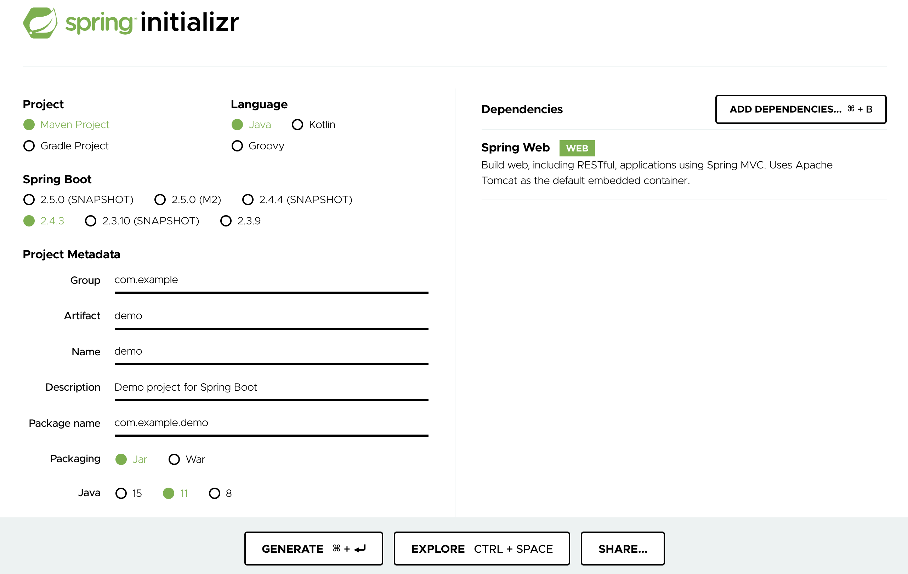
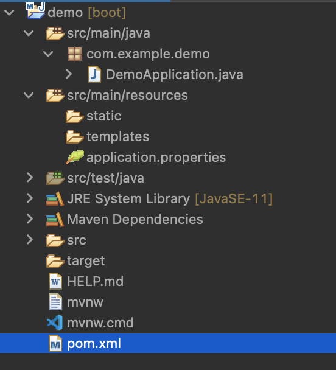
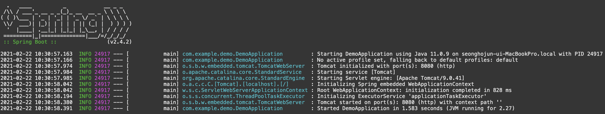

# Spring Quickstart Guide

이 문서는 [스프링 시작 가이드](https://spring.io/quickstart)  를 실습하는 내용이다.


## Step 1. 새로운 스프링 부트 프로젝트 시작

[start.spring.io](https://start.spring.io/) 를 통해 스프링 프로젝트를 생성한다.

내 경우, STS를 사용하였다.



위와 같이, Dependencies에 Spring Web을 추가하면 된다.

Generate 버튼을 눌러 다운로드한 뒤 압축을 풀면 아래와 같은 파일 구조를 볼 수 있다.




## Step 2. 코드 작성

demo/src/main/java/com/example/demo 폴더에는 DemoApllication.java 파일이 있는데 내용을 아래와 같이 바꿔준다.

```java
package com.example.demo;

import org.springframework.boot.SpringApplication;
import org.springframework.boot.autoconfigure.SpringBootApplication;
import org.springframework.web.bind.annotation.GetMapping;
import org.springframework.web.bind.annotation.RequestParam;
import org.springframework.web.bind.annotation.RestController;

@SpringBootApplication
@RestController
public class DemoApplication {

	public static void main(String[] args) {
		SpringApplication.run(DemoApplication.class, args);
	}
	
	@GetMapping("/hello")
	public String hello(@RequestParam(value = "name", defaultValue = "World") String name) {
		return String.format("Hello %s!", name);
	}
}
```

여기서 hello 메소드는 파라미터로 name을 받아 Hello 와 결합하여 돌려주는 메소드이다.

@RestController 어노테이션은 이 코드가 웹에서 동작함을 알려준다.

@GetMapping("hello") 어노테이션은 hello()메서드가 http://localhost:8080/hello 에 해당하는 요청을 처리함을 알려준다.

마지막으로 @RequestParam은 HTTP 요청에서 'name' 키의 값이 hello 메서드의 파라미터인 name에 해당하고, 만약 해당 키가 존재하지 않는다면 기본값으로 "World" 를 사용함을 알려준다.


## Step 3. 실행 및 결과 확인

아래 명령어를 프로젝트 최상위 폴더(demo)에서 실행하게 되면 웹서버가 시작되면서 우리가 작성한 코드가 동작한다.

```
./mvnw spring-boot:run
```

(맥북 기준)

아래와 같은 결과를 볼 수 있다.



마지막에서 2번째 로그를 보면 8080 포트에 내장된 톰캣 서버가 작동하는 것을 볼 수 있다.

이제 로컬호스트 8080 포트에 /hello 를 열어보자.


위와 같이 정상 작동하는 것을 알 수 있다.

여기서 name 값을 넣어 요청을 보내보자.


Default 값인 World 대신 name으로 주어진 hojun이 Hello와 결합된 모습을 볼 수 있다.


## 느낀점

아주 간단하게 Spring Boot의 사용 방법에 대해 알아보았다.

메서드로 행위를 정의하고 3개의 어노테이션을 통해 웹의 어느 부분에서 어떤 파라미터를 가지는지 간단하게 정의할 수 있었다.

@RestController, @GetMapping(uri), @RequestParam 의 사용법을 한눈에 익힐수 있었다.

